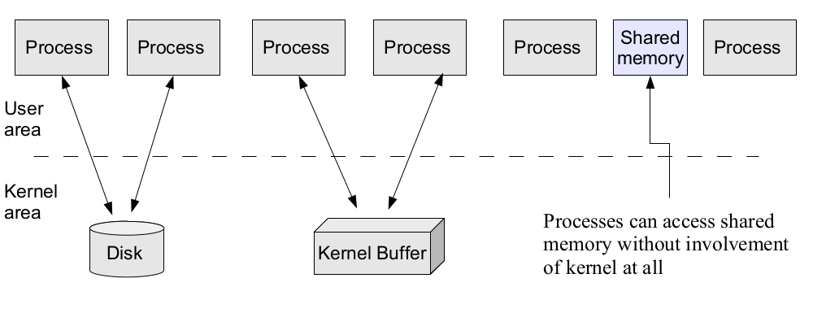
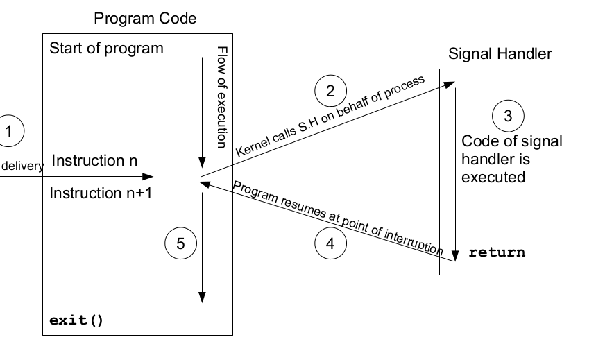

# Inter-Porcess Communication

**Inter-Process Communication** (IPC) refers to the mechanisms and techniques that allow different processes to **communicate** and **exchange** data with each other. In a multi-process environment, IPC is essential for processes to **collaborate**, **coordinate**, and **share** information.

### Ways of infomation sharing

---

- **Process-to-process** communication using disk is a method of sharing information between two or more processes by using **files** **stored** on a **disk** or **file** **system**. This approach involves writing data to a file that is accessible by **multiple** processes. Each process can read from or write to this file to **exchange** information.

- **Kernel buffers** can be used to facilitate process-to-process communication in a more efficient and controlled manner compared to disk-based communication. Kernel buffers provide **shared memory** regions that are **managed** by the **operating** system, allowing processes to **exchange** data without the overhead of disk I/O.

- **Process-to-process communication using shared memory** involves sharing a region of **memory** between **multiple** **processes**. This allows processes to exchange data **efficiently** without the need for disk I/O or **kernel** intervention.



### Categories of IPC

---

- **Communication**
- **Synchronization**
- **Signals**

### Communication

---

- Data Transfer
  - Byte Stream
    - Pipes
    - FIFO's
    - Socket Streams
  - Message Passing
    - Sys V MQ
    - POSIX MQ
    - Datagram Sockets
- Shared Memory
  - Sys V SM
  - POSIX SM
  - Memory Mapping
    - Anonymous Mapping
    - Memory Mapped Files

### Synchronization

---

- Semaphores
  - SysV Semaphores
  - POSIX Semaphores
    - Named
    - Unnamed
- Threads
  - Mutex
  - Condition Variables
- File Locks
  - File locks
  - Record Files

### Signals

---

- **Standard Signals**
  - Standard signals are a **fundamental** mechanism for inter-process communication (IPC) and event handling in **Unix-like** operating systems. They allow processes to send notifications to other processes or to the operating system itself. Each signal corresponds to a specific event or condition that can be **detected** and acted upon by the receiving process.
- **Real Time Signals**
  - Real-time signals are a type of signals in Unix-like operating systems that provide a way for processes to communicate asynchronously. Unlike standard signals, **real-time signals** have a defined order and can carry additional information with them. They are often used in **situations** where precise **timing** and **synchronization** are required.

### Persistence of IPC objects

---

#### Process Persistence

- Exists as long as it is held open by a process
- Pipes and FIFOs
- TCP, UDP sockets
- Mutex, condition variables, read write locks
- POSIX memory based semaphores

#### Kernel Persistence

- Exists until kernel reboots or IPC objects is explicitly
deleted
- Message Queues, semaphores & shared memory are at
least kernel persistent

#### File system Persistence

- Exists until IPC objects is explicitly deleted, or file
system crashes
- Message queues, semaphores & shared memory can be
file system persistent if implemented using mapped
files

### Introduction to Signals

---

Signal is a software **interrupt** delivered to a process by **OS** because

- **The process did something (SIGFPE (8), SIGSEGV (11), SIGILL (4))**
- **The user did something (SIGINT (2), SIGQUIT (3), SIGTSTP (20))**
- **One process wants to tell another process something (SIGCHILD (17))**

#### Example

- Suppose a program is running in a while(1) loop and you press
Ctrl+C key. The program dies. How does this happens?
  - User presses Ctrl+C
  - The tty driver receives character, which matches intr
  - The tty driver calls signal system
  - The signal system sends SIGINT(2) to the process
  - Process receives SIGINT(2)
  - Process dies

- Signals are usually used by OS to notify processes that some event
has occurred, without these processes needing to poll for the event.
- Whenever a process receives a signal, it is interrupted from whatever it
is doing and forced to execute a piece of code called signal handler.
When the signal handler function returns, the process continues
execution as if this interruption has never occurred.
- A **signal handler** is a function that gets called when a process receives
a signal. Every signal may have a specific handler associated with it. A
signal handler is called in asynchronous mode. Failing to handle
various signals, would likely cause our application to terminate, when it
receives such signals.

### Synchronous & Asynchronous Signals

---

**Synchronous** signals pertains to a specific action in the program
and is delivered (unless blocked) during that action.

- Most errors generate signals **synchronously**.
- Explicit request by a process to generate a signal for the same
process.

**Asynchronous** signals are generated by the events outside the
control of the process that receives them. These signals arrive at
unpredictable times during execution. Examples include

- External events generate requests **asynchronously**.
- Explicit request by a process to generate a signal for some
other process.

### Signal Delivery and Handler Execution

---



### Signal Numbers and Strings

---

- Every signal has a symbolic name and an integer value associated with
it, defined in **/usr/include/asm-generic/signal.h**

``````
kill -l
``````

- Linux supports 32 real time signals from **SIGRTMIN** (32) to
**SIGRTMAX** (63). Unlike standard signals, real time signals have no
predefined meanings, are used for application defined purposes. The
default action for an **un-handled real time** signal is to terminate the
receiving process.

``````
man 7 signal
``````

A signal can be issued in one of the following ways:

Using Key board

- <Ctrl+c> gives SIGINT(2)
- <Ctrl+\> gives SIGQUIT(3)
- <Ctrl+z> gives SIGTSTP(20)
Using Shell command

``````
kill -<signal> <PID>
OR
kill -<signal> %<jobID>
``````

If no signal name or number is specified then default is to send
SIGTERM(15) to the process

- Do visit man pages for jobs, ps, bg and fg commands
- bg gives SIGTSTP(20) while fg gives SIGCONT(18)
- Using kill() or raise() system call
- Implicitly by a program (division by zero, issuing an invalid addr, termination of a child process)

### Signal Disposition

---

Upon delivery of a signal, a process carries out one of the following
default actions, depending on the signal.

1. The signal is **ignored**; that is, it is discarded by the kernel and has no
effect on the process. (The process never even knows that it occurred)
2. The process is **terminated** (killed). This is sometimes referred to as
abnormal process termination, as opposed to the normal process
termination that occurs when a process terminates using exit()
3. A **core dump** file is generated, and the process is terminated. A core
dump file contains an image of the virtual memory of the process,
which can be loaded into a debugger in order to inspect the state of the
process at the time that it terminated
4. The process is **stopped**—execution of the process is suspended
(SIGSTOP, SIGTSTP)
5. Execution of the process is **resumed** which was previously stopped
(SIGCONT, SIGCHLD)

### Silver Bullets

---

**SIGKILL(9)** This is the sure kill signal. It can’t be blocked, ignored, or caught by a handler, and thus always terminates a process.
**SIGSTOP(19)** This is the sure stop signal. It can’t be blocked, ignored, or
caught by a handler; thus, it always stops a process.s

- Each signal has a current disposition which determines how the
process behave when the OS delivers it the signal
- If you install no signal handler, the run time environment sets up a set
of **default** signal handlers for your program

- **TERM** Abnormal termination of the program with _exit( ) i.e, no
clean up. However, status is made available to wait() &
waitpid() which indicates abnormal termination by the
specified signal
- **CORE** Abnormal termination with additional implementation
dependent actions, such as creation of core file may occur
- **STOP** Suspend/stop the execution of the process
- **CONT** Default action is to continue the process if it is currently stopped

### Masking of Signals

---

- A signal is generated by some event. Once generated, a signal is later
delivered to a process, which then takes some action in response to the
signal. Between the time it is generated and the time it is **delivered**, a
signal is said to be pending. Normally, a **pending** signal is delivered to
a process as soon as it is next **scheduled** to run, or immediately if the
process is already running (e.g., if the process sent a signal to itself).
There can be at most one pending signal of any particular type, i.e.,
standard signals are not queued

- Sometimes, however, we need to ensure that a segment of code is not
**interrupted** by the delivery of a signal. To do this, we can add a signal to
the process’s signal mask—a set of signals whose delivery is currently
blocked. If a signal is generated while it is **masked/blocked**, it remains
pending until it is later **unmasked** or **unblocked** (removed from the
signal mask).

## Links

- [Signals](https://linux.die.net/Bash-Beginners-Guide/sect_12_01.html)
- [Linux Signals](https://faculty.cs.niu.edu/~hutchins/csci480/signals.htm)
- [Traps and Interrupts](https://www.javatpoint.com/trap-vs-interrupt-in-operating-system#:~:text=The%20trap%20is%20a%20signal,event%20that%20requires%20immediate%20attention.)
- [Unix / Linux - Signals and Traps](https://www.tutorialspoint.com/unix/unix-signals-traps.htm)
- [A list of signals and what they mean](https://www-uxsup.csx.cam.ac.uk/courses/moved.Building/signals.pdf)
