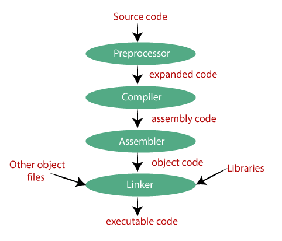
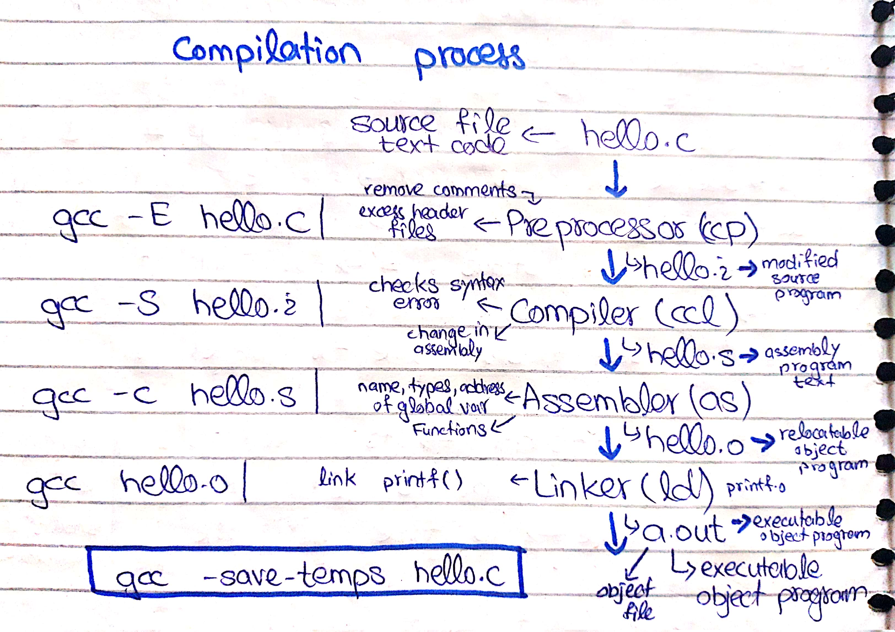
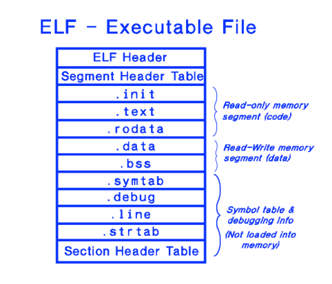
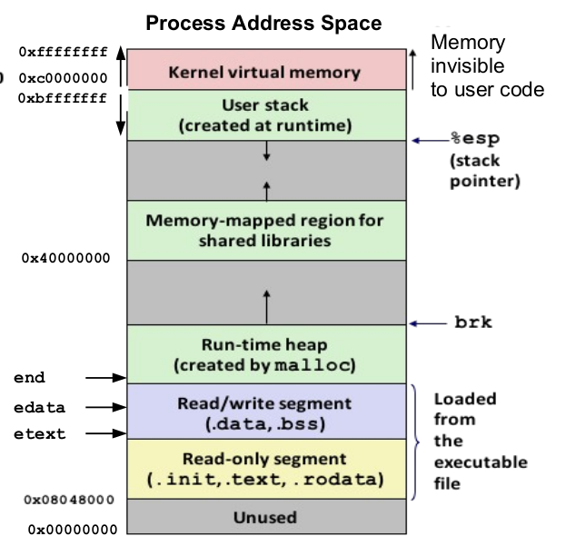

# C-Compilation

**C** compilation involves following steps

<!-- image -->



<!-- Compilation detail -->

- Firstly, the input file, i.e., hello.c, is passed to the **preprocessor**, and the preprocessor converts the **source code** into **expanded source code**. The extension of the expanded source code would be **hello.i**.
- The expanded source code is passed to the **compiler**, and the compiler converts this expanded source code into **assembly code**. The extension of the assembly code would be **hello.s**.
- This assembly code is then sent to the **assembler**, which converts the assembly code into **object code**.
- After the creation of an object code, the **linker** creates the **executable** file. The **loader** will then load the executable file for the **execution**.

<!-- image -->



```
    gcc --save-temps file.c
```

Using flag (--save-temps) will generate all the files like 

- .**i**
- .**s**
- .**o**

<br>

### Types of Object Files
---

#### Relocatable 
- (**.o file)** **Contains binary code,** A **relocatable** file holds code and data suitable for **linking** with other object files to create an **executable** or a **shared object** file.

#### Executable

- **(a.out file) Contains binary code,** and data in a
form that can be copied directly into memory and executed. **Linkers**
generates executable object files.

#### Shared Object

- **(.so file)** A special type of **relocatable** object file
that can be loaded into **memory** and linked **dynamically**, at either load
time or run time. Called **dynamic link libraries** in Windows.
Compilers and assemblers generate shared object files.

#### Core File 

- A disk file that contains the memory image of the process at
the time of its **termination**. This is generated by system in case of
abnormal process termination.

<br>

### Formats of Object Files
---

Some famous formats are 

#### a.out

- Original file format for **UNIX**. It consists of three sections: **text, data, and bss**, which are for program code, **initialized** data and
**uninitialized** data respectively.

#### COFF

- Common Object File Format was introduced with **SVR3** Unix.
**COFF** files may have multiple sections, each prefixed by a
header. The number of sections is limited. The COFF
specification includes support for debugging but the **debugging**
info was limited. Later ECOFF was introduced by **MIPS and XCOFF by IBM**.

#### ELF

- **Executable** and **Linking** Format came with **SVR4** UNIX. ELF is
similar to COFF in being organized into a number of sections,
but it removes many of **COFF's** **limitations**. ELF is used on most
modern UNIX systems, including GNU/Linux, Solaris and Irix.
Also used on many embedded systems.

#### PE

- Portable Executable format is used by **Windows** for their executables. PE is basically COFF with additional headers. The extension normally is .exe.

<br>

### [ELF Format](http://www2.cs.uidaho.edu/~krings/CS270/Notes.S10/270-F10-04.pdf)
---

- **Executable** and **Linking** Format is binary format, which is used in
**SVR4** Unix and Linux systems.
- It is a format for storing programs or fragments of programs on
disk, created as a result of **compiling** and **linking**.
- ELF not only simplifies the task of making shared libraries, but
also enhances **dynamic** loading of modules at run time.
- An **executable** file using the ELF format consist of ELF Header,
Program Header Table and Section Header Table.

The ELF format is designed to be **flexible**, **extensible**, and **platform**-**independent**, allowing it to support various architectures and operating systems. It has replaced older formats like "a.out" and "COFF" on many Unix systems.

### Key components of the ELF format include
---

**Header** The ELF file starts with a fixed-size header that contains basic information about the file, such as the architecture, the type of the file (executable, shared object, etc.), entry point address, and other essential details.

**Sections** ELF files are divided into multiple sections, each serving a specific purpose. Common sections include:

- .**text** Contains the executable code (machine instructions).
- .**data** Holds initialized data used during program execution.
- .**bss** Contains uninitialized data (it's not stored in the file but reserved for the program at runtime).
- .**rodata** Stores read-only data (constants, strings, etc.).
- .**symtab** Symbol table, which provides information about functions and variables used in the program.
- .**strtab** String table, which contains strings used in the symbol table and other parts of the file.

**Segments** Segments are used for specifying memory mapping and alignment. Each segment corresponds to one or more sections and defines how the operating system should map the file's contents into memory during execution.

**Dynamic** **Section** Contains information needed for dynamic linking, such as shared library dependencies and runtime relocation instructions.

**Symbol** **Table** Provides information about symbols (functions, variables, etc.) defined and referenced within the ELF file.

**Relocation** If the ELF file is relocatable (e.g., an object file), it contains relocation entries, specifying how to modify the code and data to reflect the actual addresses during the linking process.

<!-- ELF image -->



<br>

### Commands
---

Using these commands can view elf format of files.

```
    readelf a.out -h
```

```
    objdump a.out -d -M intel
```

```
0x08048000 <_start>: /* entry point in .text */

call __libc_init_first/* startup code in .text */

call _init
/* startup code in .init */

call atexit
/* startup code in .text */

call main
/* application main func */

call _exit
/* returns control to OS*/
```

<br>

### Process in Memory
---

<!-- Process in memory image -->



<br>

