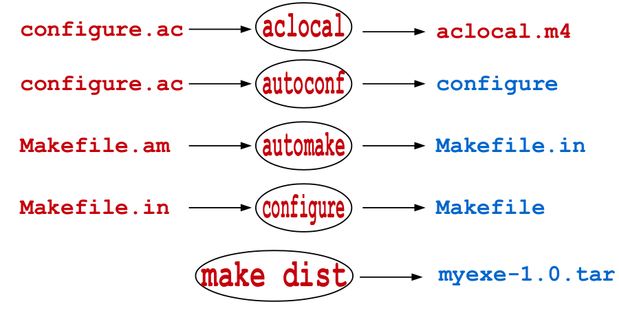

# GNU Autotools and cmake

### Binary Software Packages

---

A binary package is a collection of f iles bundled into a single file
containing

- executable files (compiled for a specific platform),
- man/info pages,
- copyright information,
- configuration and installation scripts

It is easy to install softwares from **binary** packages built for your
machine and OS, as the dependencies are already resolved.

For the Debian based distributions (Ubuntu, Kali, Mint, ArchLinux)
they come in .deb format and the package managers available are
**apt, dpkg, aptitude, synaptic**.

#### Installation

```
sudo apt-get install cmatrix
```

#### uninstall

```
sudo apt-get remove --purge cmatrix
```

For RedHat based distributions (Fedora, CentOS, OpenSuse) the
packages come in .rpm format and the available package managers
are rpm and yum.

### Open-Source Software Packages

---

An Open-source software is a software with its source code made
available with a license in which the copyright holder provides the
rights to study, change, and distribute the software to anyone and for
any purpose (GNU GPL). Normally distributed as a tarball containing

- Source code files
- README and INSTALL
- AUTHORS
- Configure script
- Makefile.am and Makefile.in

A source package is eventually converted into a binary package for a
platform on which it is conf igured, build and installed. We normally
use source packages to install softwares for following reasons

- We cannot find a corresponding binary package
- We want to enhance functionalities of a software
- We want to fix a bug in a software

#### Download

##### Option 01

You can download from some ftp repository using either
your browser or may be the famous wget command from a Linux
terminal.

##### Option 02

You can use advanced packaging tool to download in
present working directory by the following command

```
sudo apt-get source cmatrix
```

##### Option 03

You can also use git if the software is there on some
public git repository like github.com or bitbucket.org

#### Installation from source code

```
./configure
```

```
make
```

```
sudo make install
```

#### Uninstall package

Makefile has many targets other than install, like
**uninstall, clean and distclean**.

```
sudo make uninstall
```

```
make clean
```

The clean target can be used after the installation to remove all the
object and executable files from the source directory.

```
make distclean
```

Similarly, after installation if you want to remove all the files that
were created by configure script.

## Packaging a Software Using GNU Autotools



First of all write **congifure.ac**.

```
AC_INIT([penguin], [2019.3.6], [seth@example.com])
AC_OUTPUT
AM_INIT_AUTOMAKE
AC_CONFIG_FILES([Makefile])
AC_PROG_CXX
```

then run command

```
aclocal
```

it generates **aclocal.m4** and then run

```
autoconf
```

it generates **configure**

Now write **Makefile.am**

```
AUTOMAKE_OPTIONS=foreign
bin_PROGRAMS = myexe
myexe_SOURCES = src/myadd.c src/mysub.c src/mymul.c src/mydiv.c src/prog1.c src/mymath.h
```

then run command

```
automake
```

it will generates **Makefile.in** then run command

```
configure
```

it will make **Makefile** for us. Now after having makefile we can install package using

```
make 
```

Makes the executable that works properly

```
sudo make install
```

Installs the package in the **/usr/local/bin** directory

```
make dist
```

it will assemble the whole package in **tar ball** tar.gz

<br>

## packing software using CMAKE

In the simplest possible words, CMake is a cross
platform Makefile generator. It is an effort to
develop a better way to conf igure, build and deploy
complex softwares written in various languages,
across many different platforms like **Linux, *UNICES, MacOS, MS Windows, iOS, Android**.

### Friends of cmake

---

- **CMake** Build system generator
- **CPack** Package generator used to create platform- specif ci installers
- **CTest** A test driver tool used to run regression tests
- **CDash** A web application for displaying test results and performing continuous integration testing

### working of cmake

---

The CMake utility reads project description from a file
named **CMakeLists.txt** and generates a Build System
for a Makefile project, Visual Studio project, Eclipse project,
Xcode project, …

Just write **CMakeLists.txt** and then run command

```
cmake
```

it will creates the **makefile** for us. Now we can install the package by using 

```
make
sudo make install
```

Installs the package in the **/usr/local/bin** directory

#### Build

Make a build folder, do all the above process in that folder because it safe for to delete the build and then make package again easily instead the **compiled files got mixup with the source files**.

- Check the compiled software using cmake from **[Sir Arif Butt](https://arifbutt.me)** ([example cmake](https://github.com/arifpucit/SP-VLecs/tree/master/arifpucit-spvl-repo/05/cmake/ex1)).

```
cmake --help-command
```

To get help about the cmake commands and what they do.

```
cpack --config CPackSourceConfig.cmake
```

Makes a source package in the **tar ball**

```
cpack --config CpackConfig.cmake
```

Creates a debian source package.

## Links

- [cmake](https://cmake.org)
- [Introduction to GNU Autotools](https://opensource.com/article/19/7/introduction-gnu-autotools)
- [Simple Guide to Using GNU AutoTools](https://apps.dtic.mil/sti/pdfs/ADA553215.pdf)
- [Using GNU AutoTools](https://devpress.csdn.net/linux/62f637737e6682346618ad6e.html)
