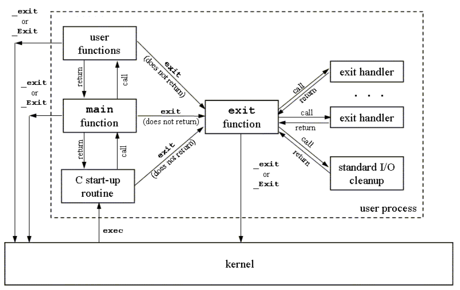

# Exit Handlers

In system programming, an exit handler is a mechanism used to register functions that are automatically executed when a program terminates or exits. These exit handlers are part of the process control mechanisms provided by the operating system. They offer a way for developers to perform cleanup tasks, release resources, or handle finalization tasks before a program terminates, regardless of whether the termination is normal or due to an error.

### How a C Porgram Starts & Terminates

---



### How a C Porgram Terminates

---

#### Normal termination

- The main function's **return** statement.
- Any function calling **exit()** library call.
- Any function calling **_exit()** system call.

#### Abnormal Termination

- Calling **abort()** function.
- Terminated by a **signal**.

### atexit()

---

The C library function int ***atexit(void (*func)(void))*** causes the specified function func to be called when the program **terminates**. You can register your termination function **anywhere** you like, but it will be called at the time of the program termination.

```
int atexit(void (*func)(void))
```

This function returns a **zero** value if the function is registered successfully, otherwise a **non-zero** value is returned if it is **failed**.

```
man atexit
```

#### Limitations

- An exit handler doesn't know what exit status was passed to
exit(); which may be useful. **e.g**., we may like to perform
different actions depending on whether the process is exiting
successfully or unsuccessfully.

- We can't specify an argument to exit handler when called; which
may be useful to define an exit handler that perform different
actions depending on its argument.

### Library Call on_exit()
---

- The **on_exit()** is also used to register exit handlers like
**atexit()**, but is a more **powerful** than atexit()

- It accepts two **arguments**, a function pointer and a void pointer
  
- The func is a function pointer that is passed two arguments **(an integer and a void*)**
  
- The first argument to func is the **integer** value passed to
exit(), and the second argument is the pointer to
**on_exit()**.

```
man on_exit
```

## Process Resource limits

- Every process has as set of resource limits that can be used to
restrict the amounts of various systems resources that the process
may consume.

- We can set the resource limits of the shell (terminal) using the
ulimit built-in command. These limits are inherited by the
processes that the shell creates to execute user commands.

- Since kernel 2.6.24, the Linux-specific **/proc/PID/limits**
file can be used to view all of the resource limits of any process.


```
man ulimit
man getrlimit
man getslimit
```

## Links

- [C library function - atexit()](https://www.tutorialspoint.com/c_standard_library/c_function_atexit.htm)