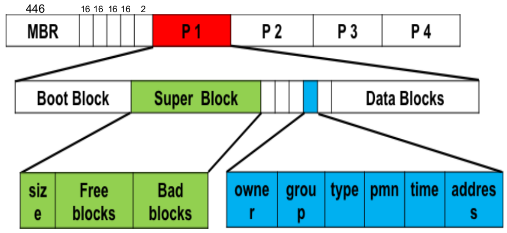

# File System Architecture

The file system architecture in Linux refers to the way files and directories are organized and managed within the Linux operating system. Linux, being a Unix-like system, uses a hierarchical file system structure that provides a standardized way to store and retrieve data. The file system architecture is responsible for managing various aspects of how data is stored, accessed, and organized on storage devices.

### File System Hierarchy

---


### Schematic Structure

---

#### Bootstrap Code

The first 446 bytes of the MBR are reserved for the bootstrap code, also known as the boot loader code. This code is responsible for starting the boot process. It's loaded into memory by the BIOS (or UEFI) and executed. The boot loader's primary role is to locate and load the operating system's bootloader (like GRUB or LILO) from a bootable partition.

#### Partition Table

The next 64 bytes (16 bytes for each of the four entries) of the MBR are used to store the partition table. This table defines the layout of the disk's partitions. Each entry contains information about a specific partition, including its starting location, size, partition type, and bootable flag. This information helps the system locate and access the various partitions on the disk.



- The **boot block** contains the boot loader code that initiates the system.
- The **superblocks** contain critical metadata about the file system's structure and properties.
- **Data blocks** store the actual content of files and directories.

### Structure of UNIX Inode

---

An inode, short for "index node," is a fundamental data structure in Unix-like file systems, including those used in Linux. It plays a crucial role in managing files and their metadata. Inodes store information about individual files, such as permissions, ownership, timestamps, and pointers to the data blocks that hold the actual content of the file.


### Creating a file

---

```
echo “This is text file......” 1> /home/f1.txt
```

When we create a file kernal searches for **free** inode block and stores meta data at the inode block and **searches** for a data blocks free and stores these free data blocks at 10 **direct** pointer place if it reserves 3 data blocks then 3 pointers become **pointing** to them

After this kernal adds the entry of file in the **directory** with inode number.

- . represents current directory
- .. represents the parent directory.

```
ls -iaR dir/
```

### Accesing a file

---

- Searches directories for file name
- Locate and read inode 32
- Checks for permissions. (userID vs file owner/gp/others)
- ***Go to the data blocks one by one, the first 10 block addresses are in
inode block. Next in single, double and tripple indirect blocks.***

### File descriptor

---

A file descriptor is an abstract representation of a file or input/output **resource** in a computer program. It's an **integer value** that the operating system uses to **uniquely** **identify** and manage resources that a program **interacts** with, such as files, network sockets, and devices.


- ***A process can open a file twice. If this is done by calling open() twice, then there will
be two different entries in PPFTD as well as in SWFT for that single file***

- ***A process can open a file twice. If this is done by calling dup(), then there will be two
entries in PPFDT but only one entry in SWFT***

- ***If two different processes opens the same file by calling open(),
there will be two different entries in SWFT***

- ***If a process opens a file by calling open(), and later fork(), then
there will be only one entry in SWFT***

### open(), read(), write(), close() paradigm

---

**fd = open(pathname, flags, mode)** opens the file identified by
pathname, returning a file descriptor used to refer to the open file in subsequent
calls. If the file doesn’t exist, open() may create it, depending on the settings of
the flags bit- mask argument. The flags argument also specifies whether the file is
to be opened for reading, writing, or both. The mode argument specifies the
permissions to be placed on the file if it is created by this call. If the open() call
is not being used to create a file, this argument is ignored and can be omitted.

**numread = read(fd, buffer, count)** reads at most count bytes from
the open file referred to by fd and stores them in buffer. The read() call returns
the number of bytes actually read. If no further bytes could be read (i.e., end-of-file
was encountered), read() returns 0.

**numwritten = write(fd, buffer, count)** writes up to count bytes
from buffer to the open file referred to by fd. The write() call returns the
number of bytes actually written, which may be less than count.

**status = close(fd)** is called after all I/O has been completed, in order to
release the file descriptor fd and its associated kernel resources.


#### Restrting

Once performing blocking I/O using a read() or write() system
calls, if the call is interrupted during its execution we need to restart
the system call. A read() on a keyboard normally blocks if the user
has not entered anything. Similarly if a read() is trying to read an
empty pipe it blocks.

### Flags used by open()

---

- O_RDONLY
- O_WRONLY
- O_RDWR
- O_CREAT
- O_APPEND
- O_TRUNC
- O_EXCL
- O_CLOEXEC

## Links

- [Unix FS](https://en.wikipedia.org/wiki/Unix_filesystem)
- [Inode in linux](https://linuxopsys.com/topics/inode-in-linux-explained)
- [Anatomy of FS](https://developer.ibm.com/tutorials/l-linux-filesystem/)
- [Ext4 filesystem](https://adil.medium.com/ext4-filesystem-data-blocks-super-blocks-inode-structure-1afb95c8e4ab)
- [File Structure Hierarchy](https://www.veritas.com/support/en_US/article.100030056)
- [Hierarchical File Structure](https://www.cis.rit.edu/class/simg211/unixintro/Filesystem.html)
- [MBR(Master Boot Record)](https://en.linuxportal.info/encyclopedia/m/mbr-master-boot-record)
- [Unix Filesystem Organization](https://web.cs.wpi.edu/~rek/DCS/D04/UnixFileSystems.html)
- [Introduction to Linux File Systems](https://docencia.ac.upc.edu/FIB/USO/Bibliografia/3-filesystems.html)
- [Introduction to the Unix File System](https://homepages.uc.edu/~thomam/Intro_Unix_Text/File_System.html)