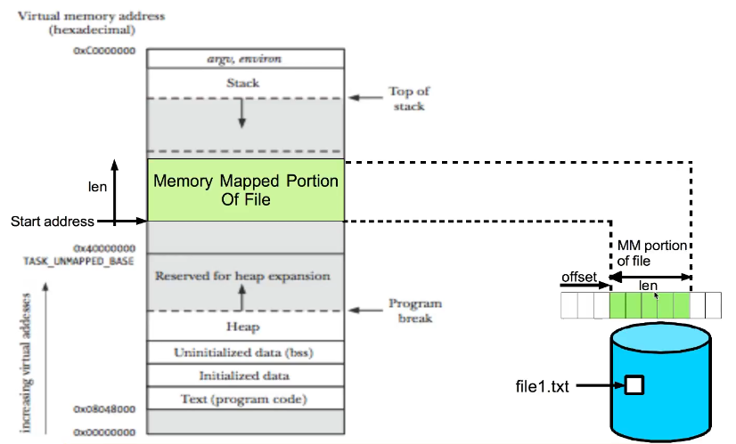

# Memory Mapped Files

Memory-mapped files, also known as memory-mapped I/O, are a technique in operating systems that allows a file to be **directly** mapped into a **process**'s **address** **space**. This means that the content of a file is **accessible** to the process as if it were part of its own **memory**. This technique provides a way to work with files using memory operations, which can improve performance and simplify data **manipulation**.

```bash
man mmap
man msync
```

- A memory mapped file is mostly a **segment** of **virtual** **memory** that has been assigned a direct **byte**-**for**-**byte** correlation with some portion of a file on disk.
- Memory mapped I/O lets us map a file on the disk into a buffer in the **Process AS**. so that when we fetch bytes from the buffer, the **corresponding** bytes of the file are **read**. Similarly, when we store data in the buffer, the corresponding bytes are the automatically **written** to the file.
- We can perform I/O without using **read**() and **write**() systemcalls.

There are two types of memory mapped files.

- **Persisted** / File Mapping (**Data saved on disk after last process finish working**).
- **Non**-**Persisted** / Anonymous Mapping (**Data is lost when last process finish working**).

<br>

<!-- Image Memory Mapping -->



### Shared File Mapping

---

In shared file mapping, **multiple** processes can map the **same** file into their address spaces simultaneously. Any modifications made to the memory-mapped region by one process are **visible** to all other processes that have **mapped** the same file.

Key points about shared file mapping

- Changes made to the memory-mapped region are **reflected** in the actual file, and changes made by one process are **immediately** visible to other processes.
- Shared file mapping is useful for scenarios where **multiple** processes need to share data or collaborate using a common memory area.
- Shared memory-mapped regions can also improve performance by **eliminating** the need for inter-process communication mechanisms like **pipes** or **sockets**.
- However, proper **synchronization** mechanisms (e.g., mutexes, semaphores) should be used to ensure data **integrity** when multiple processes are **modifying** the **shared** **data**.

### Private File Mapping

---

In private file mapping, each process maps the file into its own **private** address space. **Modifications** made by one process are **not visible** to other processes. Each process gets its own **independent** copy of the **data**.

Key points about private file mapping

- Private file mapping is useful when you want each process to work with its own **private** copy of the data.
- This mode can be used for scenarios where processes need to **manipulate** data without affecting **other** **processes** (**Copy-on-write** technique is employed), such as when each process is processing a **separate** subset of a **large** dataset.
  
### mmap() System call

```C
void *mmap(void *addr, size_t length, int prot, int flags, int fd, off_t offset);
```

- **addr** The desired starting address for the mapping. Usually set to **NULL**, allowing the kernel to choose a suitable address.
- **length** The length (size) of the memory-mapped region in bytes.
- **prot** The protection flags for the memory-mapped region. These can include **PROT_READ** (read access), **PROT_WRITE** (write access), and **PROT_EXEC** (execute access).
- **flags** Additional flags that determine how the mapping is established. Common flags include **MAP_SHARED** for shared mapping and **MAP_PRIVATE** for private mapping.
- **fd** The file descriptor of the file to be mapped. Use -1 if not mapping a file.
- **offset** The offset in the file to start **mapping** from. Ignored if **fd** is -1.

#### Return Value

- On success, mmap() returns the starting address of the memory-mapped region.
- On failure, it returns (void *)-1 and sets errno to indicate the specific error.

### msync() system call

---

```C
int msync(void *addr, size_t length, int flags);
```

- **addr** The **starting** address of the memory-mapped region.
- **length** The length (size) of the memory-mapped region in bytes.
- **flags** Synchronization flags that determine the behavior of the **synchronization**. Common flags include
  - **MS_SYNC** (synchronize changes immediately).
  - **MS_ASYNC** (asynchronous synchronization).
  - **MS_INVALIDATE** (invalidate cached data).
- On success, msync() **returns** 0.

### munmap() system call

---

```C
int munmap(void *addr, size_t length);
```

- **addr** The starting address of the memory-mapped region to be unmapped.
- **length** The length (size) of the memory-mapped region in bytes.
- On success, munmap() **returns** 0.

## Links

- [Memory Mapped Files](https://w3.cs.jmu.edu/kirkpams/OpenCSF/Books/csf/html/MMap.html)
- [Memory Mapping](https://courses.engr.illinois.edu/cs241/sp2014/lecture/11-MemoryMapping_annotated_sol.pdf)
- [Mapping](https://linux-kernel-labs.github.io/refs/heads/master/labs/memory_mapping.html)