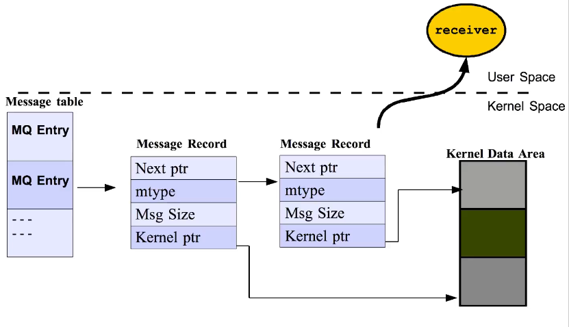

# Message Queues

Message queues are a form of inter-process communication (IPC) that enable communication and data exchange between processes in a Unix-like operating system. They provide a mechanism for **sending** and **receiving** messages between processes, allowing them to **collaborate** and **share** information. Message queues are often used in **scenarios** where processes need to communicate **[asynchronously](https://en.wiktionary.org/wiki/asynchronous)** and **efficiently**.

- can be used to pass messages b/w **related** and **unrelated** processes on same machine. They are different in two aspects from pipes and fifo's.
  - Message **boundaries** are preserved, so that **reader** and **writer** commiunicate in unit of messages.
  - they are **kernel** persistance while fifo's are **process** persistance.

- **Linklist** of messages in the **kernel space**.

- In pipes writer makes no sense unless a reader exists. In message queues this is not a requirement.

- A process can determine the status of the message queues.

- Message queues are priority driven. Queues always remain sorted in the oldest message at the highest priority.

```bash
ipcs -q  // List information about message queues
ipcrm -q <msqid>  // Remove a message queue
lsof | grep msg  //processes using MQ's
ls /dev/mqueue
ipcs -a
```

### System V and POSIX

---

The three IPC mechanisms **(message queues, semaphhores and shared memory)** referred to the **SystemV** and **POSIX** IPC through **API**.

- **System**-**V** message queues can return message of any desired **priority** while POSIX return the **oldest** message of the **highest** priority.
- **POSIX** allow the generation of **signals** when message is placed on the **empty** queue, does not in System-V.

### API related Message queues

---

|Interface| System V API| POSIX API |
|:-------:|:-----------:|:--------:|
|**Header File**|<sys/msg.h>|<mqueue.h>|
|**Data Structure** |msqid_ds|mqd_t|
|**Create/open** |msgget()|mqopen()|
|**Close**  |none|mqclose()|
|**Perform IPC** |msgsnd(), msgrcv()|mq_send(), mq_receive()|
|**Control operations** |msgctl()|mq_setattr(), mq_getattr(), mq_notify()|

### Creating Message Queue

---

The **msgget**() function is a system call in Unix-like operating systems that is used to **create** or **access** a message queue. It is part of the System V IPC (Inter-Process Communication) **API** and is commonly used for communication between processes. This API provides a set of **functions** for **message queues, semaphores, and shared memory**.

```C
int msgget(key_t key, int msgflg);
```

- **key** A key used to identify the message queue. This key can be obtained using the **ftok**() function, which converts a filename and a project identifier into a key.
- **msgflg** Flags for controlling the behavior of the message queue creation or access. Common flags include IPC_CREAT (create the queue if it doesn't exist) and permission settings (e.g., 0666 for read/write permissions for all users).

#### Return Value

- On success, msgget() returns the message queue identifier (a non-negative integer).
- On failure, it returns -1 and sets errno to indicate the specific error.

The **ftok**() function in Unix-like operating systems is used to **generate** a **unique** key that can be used to **identify** resources such as message queues, semaphores, and shared memory segments. This key is required when creating or accessing these resources using functions like **msgget**(), **semget**(), and **shmget**().

```C
key_t ftok(const char *pathname, int proj_id);
```

### Sending Messages

---

```
int msgsnd(int msqid, const void *msgp, size_t msgsz, int msgflg);
```

- **msqid** The message queue identifier obtained from the **msgget**() function.
- **msgp** A pointer to the **message** structure that you want to send. The structure must be user-defined and include a **message** type and content.
- **msgsz** The size of the message data in bytes.
- **msgflg** Flags that control the behavior of the **msgsnd**() function. Common flags include 0 (no special behavior) or **IPC_NOWAIT** (non-blocking send).

#### Return Value

- On success, msgsnd() returns 0.
- On failure, it returns -1 and sets errno to indicate the specific error.

### Receiving Messsages

---

```C
int msgrcv(int msqid, void *msgp, size_t msgsz, long msgtyp, int msgflg);
```

- **msqid** The message queue identifier obtained from the **msgget**() function.
- **msgp** A pointer to the buffer where the received message will be stored. The buffer should be large enough to accommodate the message data.
- **msgsz** The size of the buffer provided for the received message in bytes.
- **msgtyp** The message type to be received. If **msgtyp** is 0, the first message in the queue is received. If **msgtyp** is greater than 0, the first message of that type is received. If **msgtyp** is less than 0, the first message with the smallest type less than or equal to the absolute value of msgtyp is received.
- **msgflg** Flags that control the behavior of the **msgrcv**() function. Common flags include 0 (no special behavior) or **IPC_NOWAIT** (non-blocking receive).

#### Return Value

- On success, **msgrcv**() returns the number of bytes received.
- On failure, it returns -1 and sets errno to indicate the **specific** error.

#### msgtyp == 0

If msgtyp is set to 0, the msgrcv() function will receive the first message available in the message queue, regardless of its message type.
This is commonly used when you want to receive the oldest message in the queue without considering its type.

#### msgtyp > 0

If msgtyp is a positive value, the msgrcv() function will receive the first message in the queue that matches the exact message type specified by msgtyp.
This is useful when you want to receive a message of a specific type.

#### msgtyp < 0

If msgtyp is a negative value, the msgrcv() function will receive the first message in the queue with the smallest type less than or equal to the absolute value of msgtyp.
For example, if msgtyp is -3, the function will receive the first message with a type of -3, -2, -1, or 0.

### Linklist at the kernel side

---



## Links

- [Message Queue](https://en.wikipedia.org/wiki/Message_queue)
- [What is a message queue?](https://www.ibm.com/topics/message-queues)
- [Message Passing With MQ's](https://w3.cs.jmu.edu/kirkpams/OpenCSF/Books/csf/html/MQueues.html)
