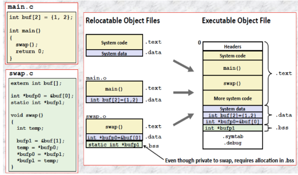

# [Linking](https://people.cs.pitt.edu/~xianeizhang/notes/Linking.html)

Linking in C is the process of combining individual **compiled** object files to create an **executable** or a **shared** library.

* In C programming, a large program is often divided into several smaller source code files, each of which is compiled into a corresponding object file. These object files contain machine code and other **necessary information** related to the functions and data defined in the source code.

- [Static and Dynamic linking in detail](staticdynamiclinking.md)

### Advantages of Linkers

---

* **Modularity** Programs can be written as a collection of smaller source
files rather than one monolithic mass. We can build libraries of
common function like the standard C library /usr/lib/x86_64-
linux-gnu/libc.a

* **Efficiency** It saves time, e.g., if we have ten source files and have
made change in only one, we need to compile only that file and not all
the files. Later of course we need to relink all the object files

### Process

---

* **Symbol** **Resolution** During compilation, functions and variables are referenced in different source files without knowing their **exact addresses** (unless they are defined in the same file). Linking resolves these references by connecting the function calls and variable references to their respective definitions across **different** object files.

* **Code** **Integration** Linking merges all the object files, combining the individual pieces of machine code into a single **executable** or **library**.

* **Library** **Handling** When using external libraries (e.g., standard libraries or user-created libraries), the linker connects the references to functions and data in these libraries with the appropriate calls and references in the program.

* **Address** **Assignment** The linker assigns memory addresses to different segments of the program (e.g., code segment, data segment, etc.) to create a complete and executable binary.

### Types

---

#### Static linking

Static linkers such as the Unix **ld** program takes as input a collection of relocatable obj files and command-line arguments and generate as output a fully linked executable obj file that can be loaded and run. The input relocatable obj files consist of various code and data sections. **Instructions / initialized global variables / uninit variables** are in different sections.

To build the executable, the linker must perform two main tasks:

* **Symbol resolution**
* **Relocation**

#### [Types of Object files](https://github.com/meharehsaan/system-programming/blob/master/c-compilation/README.md)

### Linker Symbols

---

Each relocatable obj has a symbol table that contains info about the symbols that are defined and referenced. In the context of a linker, there are three different kinds of symbols

#### **Global**

Global symbols that are defined by module and that can be referenced by other modules. Global linker symbols correspond to **nonstatic** funcs and global vars that are defined without the static attribute.
  
#### **External**

Global symbols that are referenced by module but defined by some **other** module. Such symbols are called externals and correspond to funcs and vars that are defined in other **modules**.

*Non static functions and non static global variables fall in above two categories*
  
#### **Local (static)**

Local symbols that are defined and referenced exclusively by same module. Some local linker symbols correspond funcs and global vars that are defined with the **static** attribute. These symbols are visible anywhere within **same** module, but **cannot** be **referenced** by other modules.

### Symbol Tables

---

```
    nm <file.o>
    readelf -s <main.o>
    objdump -d -M intel <filename.o>
```

Symbol tables are built by assemblers, using symbols exported by the compiler into the assembly-language .s file. An ELF symbol table is contained in the .symtab section. It contains an array of entries.

### Symbol resolution

---

The linker resolves symbol references by associating each ref with exactly one symbol definition from the symbol tables of its input relocatable obj files. Symbol resolution is easy for references to **local variables** that are defined in the same module as the ref.

* Resolving ref to **global** symbols is **trickier**. When the compiler encounters a symbol (either a var or func name) that is not defined in the current module, it assumes that it is defined in some other module, generally a linker symbol table entry, and leaves it for the linker to handle. If the linker is unable to find a def for the **referenced** symbol in any of its input modules, it prints an **error** msg and terminates.

*Linker associates each symbol reference with exactly one symbol definition*

#### Linker Symbol Rules

The three types of linker symbols (global, external, and local) are either marked as strong or weak.

* **Strong Symbols** Function names and initialized globals
* **Weak Symbols** Uninitialized globals

#### Rules

* **Rule 1** Multiple strong symbols are not allowed
* **Rule 2** Given a strong symbol and multiple weak symbols,
choose the strong symbol
* **Rule 3** If there are multiple weak symbols, choose an arbitrary
one

### Relocation

---

Once the linker has completed the symbol resolution step, it has associated each symbol ref in the code with exactly one symbol def (i.e., a symbol table entry in one of its input obj modules). At this point, the linker knows the exact sizes of the code and data sections in its input obj modules. It is now ready to begin the relocation step, where it merges the input modules and assigns run-time addr to each symbol. Relocation consists of two steps



#### Relocating sections and symbol definitions

In this step, the linker merges all sections of the same type into a new aggregate section of the same type. The linker then assigns run-time mem addres to the new aggregate sections, to each section defined by the input modules, and to each symbol defined by the input modules. When this step is complete, every instr and global var in the program has a unique run-time mem addr.

#### Relocating symbol references within sections

In this step, the linker modifies every symbol ref in the bodies of the code and data sections so that they point to the correct run-time address. To perform this step, the linker relies on data structures in the relocatable obj modules known as **relocation entries**.

#### Relocation entries

When an assembler generates an obj module, it does not know where the code and data will ultimately be stored in memory. Nor does it know the locs of any externally defined funcs or global vars that are referenced by the module. So, whenever the assembler encounters a ref to an obj whose ultimate loc is unknown, it generates a relocation entry that tells the linker how to modify the ref when it merges the obj file into an executable. Relocation entries for code are placed in **.rel.text, and for inited data are in .rel.data.**

### Loading executable obj files

---

Any Unix program can invoke the loader by calling the execve function, which copies the code and data in the executable object file from disk into memory, and then runs the program by jumping to its first instruction, or entry point. This process of copying the program into memory and then running it is known as loading.

### The Librarian (ar utility)

---

ar is a Unix tool also called librarian that allows us to

#### Create

-r create a new archive

```
ar -r libfirst.a file1.o file2.o
```

-q append an object file to an existing archive

```
ar -q libfirst.a file3.o
```

-d delete object modules from an existing archive

```
ar -d libfirst.a file2.o
```

#### Extract

-x extract object modules in your PWD

```
ar -x /usr/lib/libm.a
```

#### Display

-t display table of contents of an archive

```
ar -t /usr/lib/libm.a
```

## Links

* [Linking](https://people.cs.pitt.edu/~xianeizhang/notes/Linking.html)
* [Static and Dynamic linking in detail](staticdynamiclinking.md)
* [C Compilation](https://github.com/meharehsaan/system-programming/blob/master/c-compilation/README.md)
* [Symbol table in linking](https://stackoverflow.com/questions/45403613/symbol-table-in-linking)
* [How static linking works on linux](https://opensource.com/article/22/6/static-linking-linux)
* [Static Versus Dynamic Linking: When to Use Each](https://blog.hubspot.com/website/static-vs-dynamic-linking#:~:text=Static%20linking%20is%20the%20practice,code%20with%20all%20required%20libraries.)
* [The Linking Process Exposed — Static vs Dynamic Libraries](https://medium.com/@dkwok94/the-linking-process-exposed-static-vs-dynamic-libraries-977e92139b5f)
