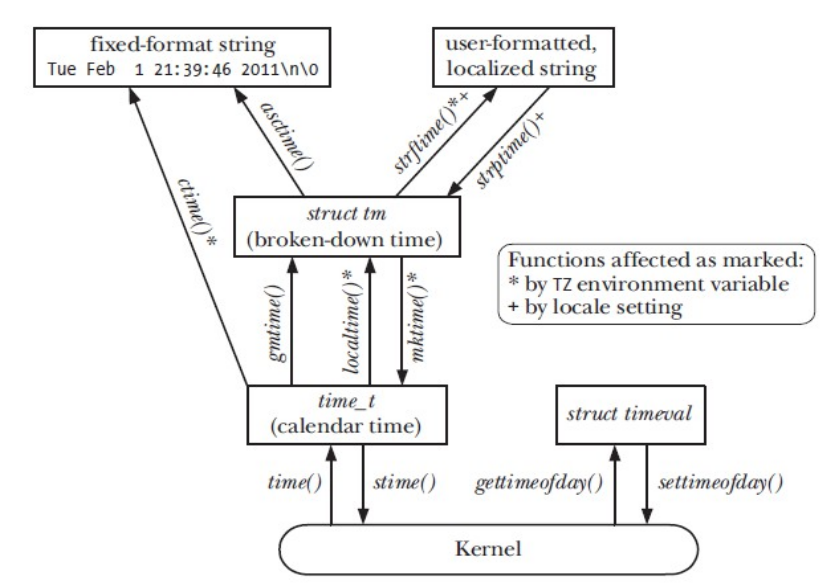

# ls Utility

The **ls utility** is a command-line tool commonly found in Unix-like operating systems (such as Linux and macOS) that is used to **list** the **contents** of a **directory**.

### Source code

---

Check the source code of ls utility different version on my **[linux-utilities](https://github.com/meharehsaan/linux-utilities)** repository on github

- Link to `source` code [**ls-utility**](https://github.com/meharehsaan/linux-utilities/tree/master/ls-utility).

## ls Utility

The ls utility is a command-line tool commonly found in Unix-like operating systems (such as Linux and macOS) that is used to list the contents of a directory.

### Long listing(ls -l)

---

The long listing of ls command displays seven columns for each
file

1. [File Type]() (-,d,l,p,c,b,s) and Permissions **(rwxrwxrwx)**
2. Link Count
3. User
4. Group
5. Size
6. Time
7. Name of file

***These attributes of a file (less its name) are not stored
in dirent structure***.

### Commonly used options

- -**l**: Long format listing. Displays detailed information about each file, including permissions, ownership, size, and modification date.
- -**a**: List all files, including hidden files (those starting with a dot .).
- -**h**: Human-**readable** file sizes. Shows sizes in a more human-readable format (KB, MB, GB, etc.).
- -**R**: Recursive listing. Lists directory contents recursively, including subdirectories.
- -**t**: Sort by modification time, displaying the most recently modified files first.
- -**r**: Reverse order. Lists files in reverse order.
- -**S**: Sort by file size.
- -**G**: Enable colorized output, highlighting different file types with colors.

### Directory Management Calls

---

Calls used to create and delete directories in system.

### mkdir and rmdir

---

```
int mkdir(const char *pathname, mode_t mode);
int rmdir(const char *pathname);
```

mkdir function creates a new **empty** directory with two entries **. & ..**

Permissions on the created directory are

```
mode & ~umask & 0777
```

By default umask in **regular** user is **0002** and for **root** user it is **0022**.

- The new directory will be owned by the effective **UserID** of the process
  
- The **rmdir** function is used to delete an **empty** directory. If the **link count** of
the directory becomes **0** with this call, and if no other process has the directory
open, then the space occupied by the directory is **freed**.
- If one or more processes have the directory open when the link count reaches **0**
then
  - The **last** link is removed.
  - The . and .. entries are removed before the function return.
  - No new files can be created in this directory.
  - The directory is freed when the last process closes it.

### opendir() Function

---

```
DIR *opendir(const char* dirpath);
```

The **opendir**() function opens the directory specified by **dirpath** and
returns a pointer to a structure of type **DIR**, which is used to refer that
directory in later calls. Upon return from **opendir**(), the directory stream
is **positioned** at the first entry in the directory list.

```
int closedir(DIR *dirp);
```

The **closedir**()
function closes the directory **stream** associated with
dirp.

- Directories can be read by anyone who has access **permission** to read the
directory. But only the kernel can **write** to a directory, so the write
permission bits and execute permission bits for a directory determine if we
can **create** new files in the directory and **remove** files from the directory.

### readdir() Function

---

```
struct dirent *readdir(DIR *dirp);
```

The **readdir**() function is passed the **DIR*** which is returned by
**opendir**(). Every time it is called it returns an entry from the directory
stream referred to by dirp. The return value is a pointer to a structure of
type **dirent**, containing the following information about the entry (it may
vary from OS to OS).

```
struct dirent {
ino_t d_ino; /* File i-node number */
char d_name[]; /* Null-terminated name of file */
};
```

- This structure is **overwritten** on each call to readdir().

- The filenames returned by **readdir**() are not in **sorted** order, but rather in
the order in which they happen to occur in the directory (this depends on the
order in which the file system adds files to the directory and how it fills **gaps**
in the directory list after files are removed). (The command ls –f lists
files in the same **unsorted** order that they would be retrieved by **readdir**().

On end-of-directory or **error**, **readdir**() returns **NULL**, in the latter case
setting errno to indicate the error. To distinguish these two cases, we can
write the following

``````
errno = 0;
struct dirent *entry = readdir(dp);
If ((entry == NULL) && (errno != 0))
/* Handle error */
else
/* We reached end-of-directory */
``````

If the contents of a directory change while a program is scanning it with
**readdir**(), the program might not see the changes. SUSv3 **explicitly**
notes that it is unspecified whether **readdir**() will return a filename that
has been added to or removed from the directory since the last call to
**opendir**(). All filenames that have been neither added nor removed since
the last such call are **guaranteed** to be returned

### Other Functions

---

```
int chdir(const char *pathname);
```

The **chdir**() function is used to change the current working
directory of the calling process, and pathname is the directory where
the search for all relative pathname starts.

```
void rewinddir(DIR *dirp);
```

The **rewinddir**() function moves the directory stream dirp back
to the beginning, so that the next call to readdir() will begin again
with the first file in the directory.

```
off_t telldir(DIR *dirp);
```

The **telldir**() function returns the current location associated with the
directory stream dirp.

```
void seekdir(DIR *dirp, long loc);
```

The **seekdir**() function sets the location in the directory stream from
which the next readdir() call will start. The loc argument should be a
value returned by a previous call to telldir().

### stat() System call

---

```
int stat(const *char pathname, struct stat *buff);
int lstat(const *char linkname, struct stat *buff);
```

- These functions can be used to access the file **attributes** stored in its
inode. To stat a file **no** **permissions** are required on the file **itself**,
however, execute (search) permission is required on all of the
directories in pathname that leads to the file.
- **stat**() stats the file pointed by path and **fills** in buff
- **lstat**() is **similar** to **stat**, except if path is a **symbolic** link, then
the link itself is stated , not the file it refers to.
- On success returns 0 and on error returns -1 and set **errno**.

### Real Time

---

Obtaining **calender** time is useful to programs, e.g, to update **timestamps** of
files

- Regardless of geographic location, UNIX system represent time internally as
measure of seconds since the `epoch`; **i.e since midnight 00:00, Jan 1 , 1970,**
Universal Time (UTC, previously known as **Greenwich** Mean Time GMT)
- On 32-bit Linux system, **time_t** is a signed integer that is used to store the
number of seconds passed since the UNIX epoch. It can represent dates in
the range of

**13 Dec 1901 20:45:52 to 19 Jan 2038 03:14:07**

### time() and ctime() Functions

---

```
time_t time(time_t *t);
char* ctime(const time_t* timep)
```

- The **time**() function is used to get the time since UNIX Epoch in
seconds. If the argument is non-null, the return value is also stored in
the memory.
- The **ctime**() function takes the number of seconds and return the date format of epoch.

### Relationship of Time Functions

---


