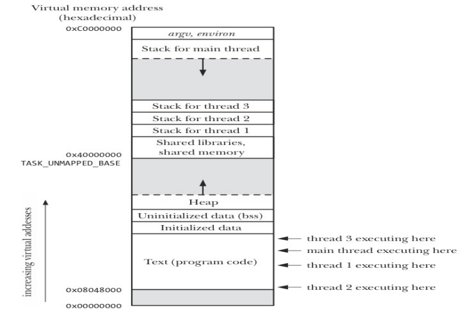

# Multi Threaded Programming

A thread is an **execution** context that is **independently** scheduled,
but **shares** a single addresses space with other **threads** of the
same process.

#### Compilation

```bash
gcc programname.c -lpthread; ./a.out
```

## Ways to Achieve Concurrency

#### Multiple single threaded processes

- Use **fork**() to create a new process for handling every new
task, the **child** process **serves** the client process, while the parent
listens to the **new request**.
- Possible only if each **slave** can operate in **isolation**
- Need IPC between processes
- *Lot of memory and time required for process creation.*

#### Multiple threads within a single process

- Create **multiple** threads within a **single** process.
- Good if each **slave** need to share data.
- Cost of creating threads is low, and no IPC required.

#### Single process multiple events

- Use non-blocking or asynchronous I/O, using **select**() and
**poll**()system calls.

### Processes and Threads (cont...)

#### Similarities between Processes & Threads

- Like a process, a thread can also be in one of many **states**
**(new, ready, running, block, terminated)**
- Only one thread can be in **running** state (single **CPU**)
- Like a process a thread can create a **child** **thread**.

#### Differences between Processes & Threads

- No automatic **protection** in threads
- Every process has its **own** address space, while all other
threads within a process executes within the **same address space**.

#### Every process has two characteristics

- **Resource ownership** **=>** process includes a virtual address
space to hold the process image
- **Scheduling** **=>** follows an execution path that may be
**interleaved** with other processes.

These two characteristics are treated independently by the
operating system. The unit of resource ownership is referred to
as a process, while the unit of **dispatching** is referred to as a
thread.

### Single vs Multiple Threaded Process

---


### View of a Multi-threaded Process Stack

---



### Multi-Threaded Process

---

| Threads within a process share | Threads have their own |
|:------------------------------|:----------------------|
|PID, PPID, PGID, SID, UID, GID  | Thread ID |
|Code and Data Section           | CPU Context (PC, and other registers)|
|Global Variables                |Stack|
|Open files via **PPFDT**        |State|
|Signal Handlers                 |The errno variable|
|Interval Timers                 |Priority|
|CPU time consumed               |CPU affinity |
|Resources Consumed              |Signal mask |
|Nice value                      | |
|Record locks (created using **fcntl**())|

### LinuxThreads

---

LinuxThreads is the **original** Linux threading implementation, developed by
**Xavier Leroy**. In addition to the threads created by the application, LinuxThreads
creates an additional “**manager**” thread that handles thread **creation** and
**termination**. Threads are created using a **clone**(), with the flags mentioned
below

**CLONE_VM | CLONE_FILES | CLONE_FS | CLONE_SIGHAND**

*(threads share virtual memory, file descriptors, file system-related
information (umask, root directory, pwd,...) and signal disposition)*

#### Deviations from specified behavior

- **getpid**() returns a different value in each of the threads of a process.
- **getppid**() returns the PID of the **manager** thread,
- If one thread creates a child using **fork**(), then **only** the thread that created the child process can
**wait**() for it.
- If a thread calls **exec**(), then SUSv3 requires that all other threads are **terminated**. While this is not so
in LinuxThreads.
- Threads don't share **PGIDs**, and **SIDs**.
- Threads don't share resource limits.
- Some versions of ps(1) show all of the threads in a process (including the manager thread) as separate items with **distinct** PIDs.
- CPU time returned by **times**() and resource usage information returned by **getrusage**() are per
thread
- Threads don't share **nice** value set by **setpriority**()

### NPTL Threads

The **Native POSIX Threads Library** (NPTL) is is the modern Linux Threading
implementation, developed by **Drepper** and **Ingo** **Molnar**, designed to address
most of the **shortcomings** of LinuxThreads. It **adheres** more closely to SUSv3
specification. Applications that employ large number of threads scale much
better under **NPTL** than under **LinuxThreads**. NPTL threads does not require an
**additional** manager thread. Supported by Linux 2.6 onwards. Threads are created
using **clone**(), that specifies all the flags of LinuxThreads and more

**CLONE_VM | CLONE_FILES | CLONE_FS | CLONE_SIGHAND | CLONE_THREAD | CLONE_SETTLS | CLONE_PARENT_SETTID | CLONE_CHILD_CLEARTID | CLONE_SYSVSEM**

To discover thread implementation on your system give following command

```bash
getconf GNU_LIBPTHREAD_VERSION
getconf GNU_LIBC_VERSION
```

On systems that provides both **NPTL** and **LinuxThreads**, if you want to run a
**multithreaded** program with LinuxThreads, you set the following **environment**
**variable** to a **kernel** version that doesn't provided support for NPTL (e.g., 2.2.5)

```bash
export LD_ASSUME_KERNEL=2.25
```

### Pthreads API

---

The pthread API defines a **number** of data types and should be used to **ensure** the
**portability** of **programs** and mostly defined in **/usr/include/x86_64-linux-gnu/bits/pthreadtypes.h**.

Remember you should not use the **C** **==** **operator** to compare **variables** of these types.

| Data Types | Description |
|:-----------|:------------|
| pthread_t | Use to identify a thread
| pthread_attr_t | Used to identify a  |thread attributes object |
| pthread_mutex_t | Used for mutex
| pthread_mutexattr_t | Used to id |entify mutex attributes object |
| pthread_cond_t | Used for condition variable
| pthread_cond_attr_t | Used to identify  |condition variable attributes object |
| pthread_key_t | Key for thread specific data
| pthread_once_t | One-time initialization  |control context |
| pthread_spinlock_t | Used to identify spinlock |
| pthread_rwlock_t | Used for read-write lock
| pthread_rwlockattr_t | Used for read-write  |lock attributes |
| pthread_barrier_t | Used to identify a barrier |
| pthread_barrierattr_t | Used to identify a barrier attributes object |

```C
int pthread_create(pthread_t *tid, const pthread_attr_t *attr, void *(*start)(void *), void *arg) ;
```

- This function starts a new thread in the **calling** process. The new
thread starts its execution by invoking the **start** function which is
the 3rd argument to above function
- On success, the TID of the new thread is returned through 1st
argument to above function.
- The 2nd
argument specifies the **attributes** of the newly created
thread. Normally we pass **NULL** pointer for default attributes.
- The 4th argument is a pointer of type **void** which points to the value
to be **passed** to **thread** start function. It can be NULL if you do not
want to pass any thing to the thread function. It can also be **address**
of a **structure** if you want to pass **multiple** arguments.

```C
void pthread_exit(void *status);
```

This function **terminate** the calling thread

- The **status** value is returned to some other thread in the calling
process, which is **blocked** on the **pthread_join**() call
- *The pointer status must not point to an object that is **local** to the calling thread, since that object **disappears** when the thread terminates.*

#### Ways for a thread to terminate

- The thread function calls the **return** statement
- The thread function calls **pthread_exit**()
- The main thread **returns** or call **exit**()
- Any sibling thread calls **exit**()

```C
int pthread_join(pthread_t tid, void **retval);
```

- Any **peer** thread can wait for **another** thread to **terminate** by
calling **pthread_join**() function, similar to **waitpid**().
Failing to do so will produce the thread equivalent of a **zombie**
process
- The 1st argument is the ID of thread for which the calling thread
wish to **wait**. Unfortunately, we have no way to wait for any of
our threads like **wait**()
nd
- The 2 argument can be **NULL**, if some peer thread is not
interested in the return value of the new thread. Otherwise, it can
be a double pointer which will point to the **status** argument of the
**pthread_exit**().

### Returning value from a Thread Function

---

- A thread function can return a **pointer** to its parent/calling thread,
and that can be received in the 2nd argument of the
**pthread_join**() function
● The pointer returned by the **pthread_exit**() must not point to
an object that is **local** to the **thread**, since that variable is created in
the local stack of the **terminating** thread function.
● Making the local variable **static** will also fail. Suppose two
threads run the same **thread_function**(), the second thread
may **over** **write** the **static** variable with its own return value and
return value **written** by the first thread will be **over** **written**.
● So the best solution is to create the **variable** to be **returned** in the
**heap** instead of stack.

### Creating Arrays of Threads

---

- Need to create **large** **number** of threads for dividing the
**computational** tasks as per your program logic.
● At **compile** time, if you know the number of threads you need,
you can simply **create** an array of type **pthread_t** to store the
thread IDs
● If you do not know at compile time, the number of threads you
need, you may have to to **allocate** memory on **heap** for storing the
thread IDs
● The maximum number of threads that a system allow can be seen
in **/proc/sys/kernel/threads-max** file. There are
however, other **parameters** that limit this count like the **size** of
stack the **system** needs to give to every new thread.

## Links

- [An Introduction to Multi-Threading C Programs](https://www.digikey.com/en/maker/blogs/2022/an-introduction-to-multi-threading-c-programs)
- [Multithreading](https://beej.us/guide/bgc/html/split/multithreading.html)
- [POSIX Threads](http://www.csc.villanova.edu/~mdamian/threads/posixthreads.html)
- [Multi-Threaded Programming With POSIX Threads](https://www.cs.kent.edu/~ruttan/sysprog/lectures/multi-thread/multi-thread.html)
