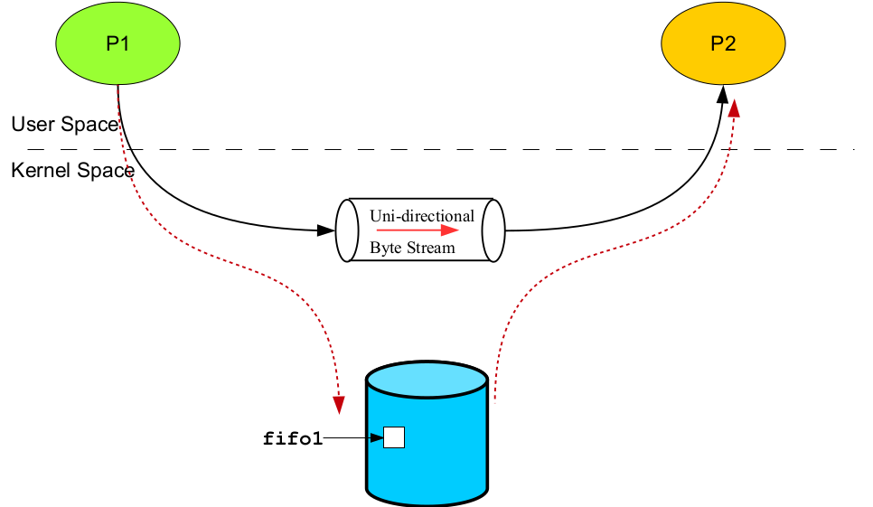

# FIFO's (Named Pipes)

FIFOs, also known as named pipes, are a form of inter-process communication (IPC) in Unix-like operating systems. A FIFO is a special type of file that acts as a unidirectional communication channel, allowing unrelated processes to exchange data. FIFOs are commonly used when you need to establish communication between processes that are not directly related, unlike parent-child relationships.

- UNIX FIFO is similar to a pipe, as it is a one way (half duplex) flow of
data. But unlike pipes a FIFO has a path name associated with it
allowing unrelated processes to access a single pipe.

- FIFOs/named pipes are used for communication between related or
unrelated processes executing on the same machine.

- A FIFO is created by one process and can be opened by multiple
processes for reading or writing. When processes are reading or writing
data via FIFO, kernel passes all data internally without writing it to the
file system. Thus a FIFO file has no contents on the file system; the
file system entry merely serves as a reference point so that processes
can access the pipe using a name in the file system.



### mkfifo() Library Call

---

- Makes a FIFO special file with name **pathname**. The second
argument mode specifies the FIFO’s permissions. It is modified by the
process’s **umask** in the usual way **(mode & ~umask)**.
- Once you have created a FIFO, any process can open it for reading or
writing, in the same way as an ordinary file. Opening a FIFO for
reading normally blocks until some other process opens the same
FIFO for writing, and vice versa.
- Call Fails when:
  - Parent directory does not allow write permission
  - Path name already exists
  - Path name points outside accessible address space
  - Path name too long
  - Insufficient kernel memory

Named pipes are created using the mkfifo command or the mkfifo() system call.
They are called "named pipes" because they are files in the file system that behave like pipes but have a name associated with them.

``````
int mkfifo(const char*pathname, mode_t mode);
``````

```
mkfifo fifo1 //creates fifo
```

A named pipe is a file with a special mode and attributes that enable its use for communication.
It appears in the file system like any other file and can be accessed using file I/O operations.

### mknod() System Call

``````
int mknod(const char*name, mode_t mode, dev_t device);
``````

- The **mknod**() system call creates a FIFO file with name mentioned as the first argument.
- The second argument mode specifies both the permissions to use
and the type of node to be created. It should be a combination (using
bitwise OR) of one of the file types (**S_IFREG**, **S_IFIFO**,
**S_IFCHR**, **S_IFBLK**, **S_IFSOCK**) and the permissions for the
file.
- For creating a named pipe the third argument is set to zero. However,
to create a character or block special file we need to mention the
major and minor numbers of the newly created device special file.

<br>

---


# Links

- [FIFOs in Linux](https://www.softprayog.in/programming/interprocess-communication-using-fifos-in-linux)
- [Pipes and FIFOs](https://w3.cs.jmu.edu/kirkpams/OpenCSF/Books/csf/html/Pipes.html)
- [FIFO special files](https://www.ibm.com/docs/en/zos/2.3.0?topic=csf-fifo-special-files)
- [Named Pipes: FIFOs](https://docstore.mik.ua/orelly/unix3/upt/ch43_11.htm)