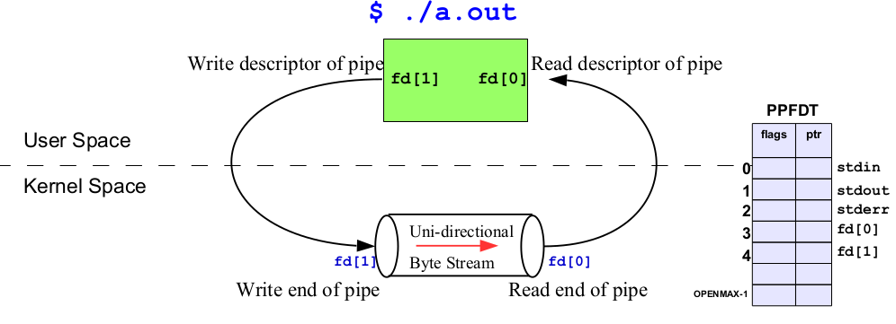
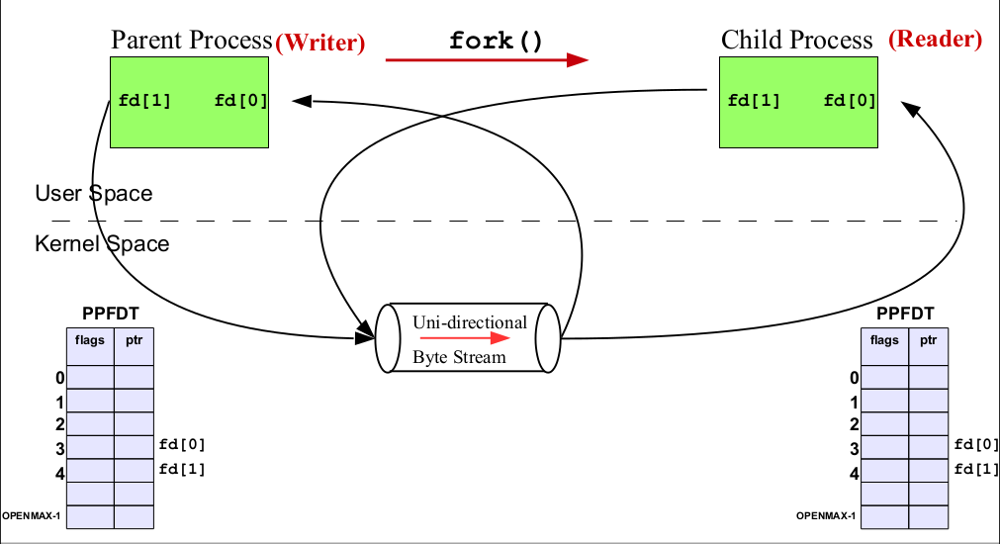
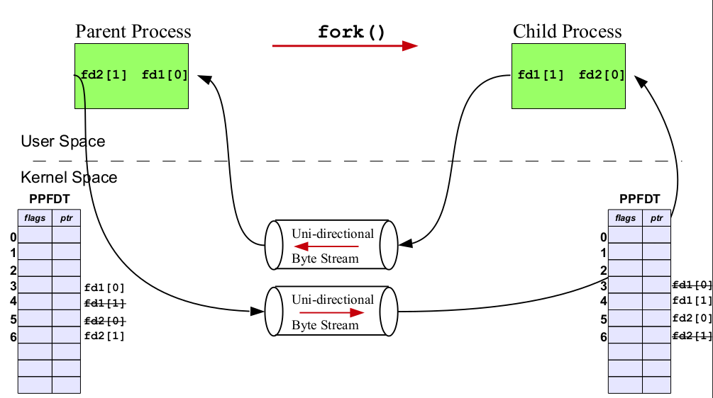
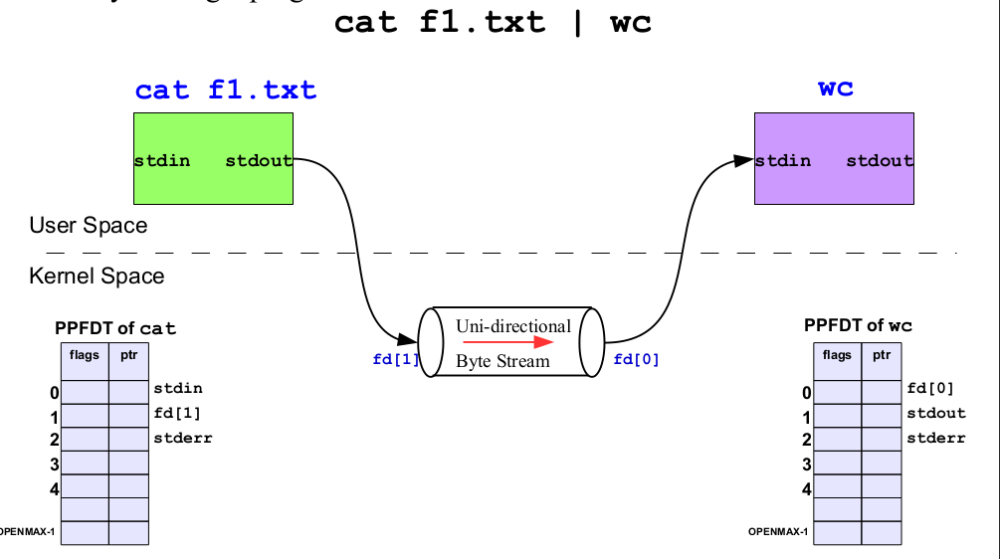
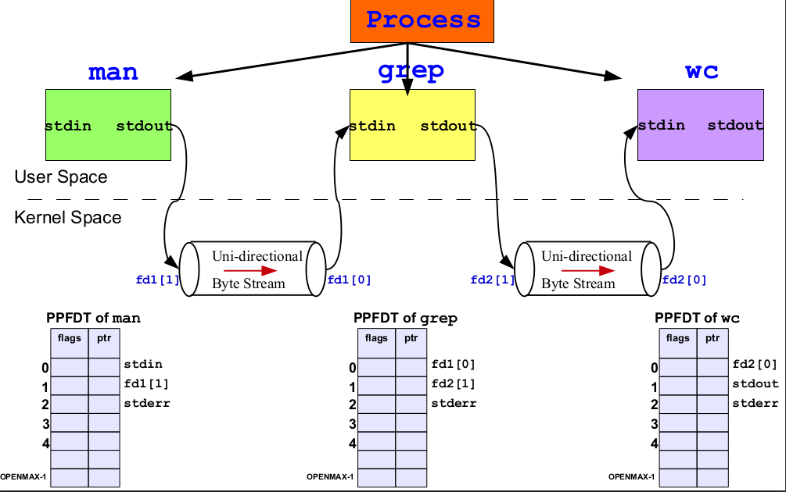

# Pipes

Pipes in Unix-like operating systems are a form of inter-process communication (IPC) that allow data to be transferred between two processes. Pipes are unidirectional communication channels used to connect the output of one process (the writing end) to the input of another process (the reading end). Pipes are a simple yet powerful way to enable communication and coordination between processes.

```
// Using pipes to count lines in a file
cat file.txt | wc -l
```

- The **output** of the **cat** program directed towards the **pipe** and **wc** program gets **input** from the pipe.

- Pipes have no names, and their biggest disadvantage is that they can be
only used between processes that have a parent process in common
(ignoring descriptor passing)

### Introduction to pipes

---

#### History of Pipes

Pipes history goes back to 3rd edition of UNIX
in 1973. They have no name and can therefore be used only
between related processes. This was corrected in 1982 with the
addition of FIFOs

#### Byte stream

When we say that a pipe is a byte stream, we mean
that there is no concept of message boundaries when using a pipe.
Each read operation may read an arbitrary number of bytes
regardless of the size of bytes written by the writer. Furthermore,
the data passes through the pipe sequentially, bytes are read from
a pipe in exactly the order they were written. It is not possible to
randomly access the data in a pipe using lseek().

#### Blocking Behavior

- When reading from a pipe, a process will block (wait) if no data is available until data becomes available or the writing end is closed.
- When writing to a pipe, a process will block if the pipe's internal buffer is full, waiting for space to become available.

#### Data Integrity

- Pipes are suitable for transferring structured data or plain text between processes.
- Data integrity is the responsibility of the communicating processes.
- If the write end of a pipe is closed, and a process tries to read, it
will receive and EOF character, i.e., read() returns 0
- If two processes try to read from the same pipe, one process will
get some of the bytes from the pipe, and the other process will get
the other bytes. Unless the two processes use some method to
coordinate their access to the pipe, the data they read are likely to
be incomplete.

#### Size of Pipe

- If multiple processes are writing to a single pipe, then it is
guaranteed that their data won’t be intermingled if they write no
more than PIPE_BUF bytes at a time
- This is because writing PIPE_BUF number of bytes to a pipe is
an atomic operation. On Linux, value of PIPE_BUF is 4096
- When writing more bytes than PIPE_BUF to a pipe, the kernel
may transfer the data in multiple smaller pieces, appending
further data as the reader removes bytes from the pipe. The
write() call blocks until all of the data has been written to the
pipe
- When there is a single writer process, this doesn’t matter. But in
case of multiple writer processes, this may cause problems.

### Pipe Creation System call

---

``````
int pipe(int fd[2]);
``````

If pipe syscall fails **returns** -1.

- Creating a pipe is similar to opening two files. A successful call to
**pipe**() returns two open file descriptors in the **array** **fd**; one
contains the **read** descriptor of the pipe, fd[0], and the other contains
the **write** descriptor of the pipe fd[1].
- As with any file descriptor, we can use the **read**() and **write**()
system calls to perform I/O on the pipe. Once written to the write end
of a pipe, data is **immediately** available to be read from the read end. A
read() from a pipe blocks if the pipe is **empty**.
- From an implementation point of view, a pipe is a fixed-size main
**memory circular buffer created and maintained by the kernel**. The
kernel handles the synchronization required for making the reader
process wait when the pipe is empty and the writer process **wait** when
the pipe is **full**.

``````
int pipe2(int fd[2], int flags);
``````

- The **pipe2**() system call can also be used to create a pipe. The
second argument **flags** in **pipe2**() is used to control the **attributes**
of the pipe **descriptors**. A zero in the flags argument make **pipe2**()
behave like **pipe**() system call.

- The second argument can be a bit-wise OR of two values:
  - **O_CLOEXEC** Set the **close-on-exec** flag on the pipe descriptors,
    - i.e., when a process executes an **exec**() system call, it does not
    inherit an already open pipe.
  - **O_NONBLOCK** Set pipe descriptors for **nonblocking** I/O.
- We can also use the stdio functions (printf(), scanf(), and so
on) with pipes by first using **fdopen**() to obtain a file stream
corresponding to one of the descriptors in fd. However, when doing
this, we must be aware of the stdio buffering issues.


### Usage of pipe in process

---

```
int fd[2];
pipe(fd);
int cw = write(fd[1],msg, strlen(msg));
int cr = read(fd[0], buf, cw);
write(1, buf, cr);
```



- We get two more descriptors in **PPFDT** table of that process.

```
ls /proc/<PTD>/fd/
```

### Use of Pipe Between two Related Processes

---




### Bidirectional Communication Using Pipes

---



### cat f1.txt | wc

---



### man ls | grep ls | wc -l

---



- Check out the source codes of all the examples.

## Links

- [Pipeline](https://en.wikipedia.org/wiki/Pipeline_(Unix))
- [Pipes in detail](https://slideplayer.com/slide/253497/)
- [Pipe vs FIFO](https://www.gnu.org/software/libc/manual/html_node/Pipes-and-FIFOs.html#:~:text=The%20pipe%20has%20no%20name,names%20like%20any%20other%20file.)
- [Pipes: A Brief Introduction](https://www.linfo.org/pipes.html)