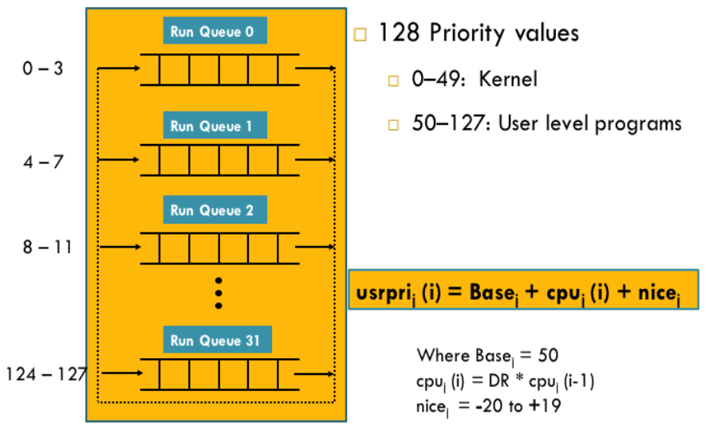
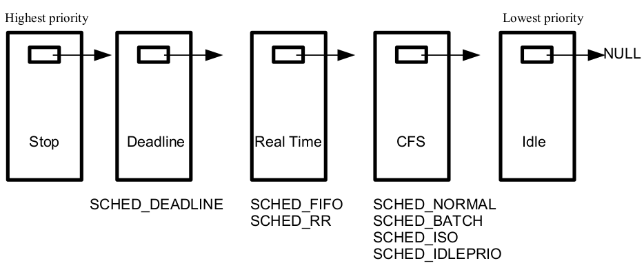

# Process Scheduling Algorithms

Scheduling is a matter of **managing queues** to minimize **queueing delay** and to **optimize** performance in a queueing **environment**.

The process scheduler in a **multitasking** operating system is a
**kernel** component that **decides** which process runs, when and for
**how long**.

### Multitasking

---

A multitasking OS comes in two flavors

- In Preemptive multitasking, the scheduler decides when a
process is to **cease** running (e.g., time slice expires) and a new
process is to begin running. On many modern OSs, the time slice
is **dynamically** calculated as a **fraction** of process **behavior** and
**configurable** system policy.

- In Cooperative multitasking, a process does not stop running
until it **voluntary** decides to do so.

### Preemptive vs Non-Preemptive Kernels

---

- Line of Control LOCs

At any instant of time a system can either be executing in **user** mode
(executing **LOCs** written by programmer) or **kernel** mode (executing **LOCs** written by the kernel developer).

- A) In process context (a system call made by programmer)
- B) In interrupt context

The three types of OS **kernel** are

- **Preemptive Kernel**, a kernel that can be preempted both in A and B.
- **Reentrant Kernel**, a kernel that can be preempted in A only.
- **Nonpreemptive Kernel**, a kernel **cannot** be preempted.

### Types of Processes

---

#### Interactive Processes

These interact constantly with their users.
When input is received, the average delay must fall between 50-150
ms, otherwise the user will find the system to be unresponsive.
Typical interactive programs are command shells, text editors and
graphical applications.

#### Batch Processes

These do not need user interaction and often
execute in the back ground and are often penalized by the
scheduler. Typical batch programs are programming language
compilers, database search engines and scientific computations.

#### Real-time Processes

These processes should have a short
guaranteed response time with a minimum **variance**. Typical real-
time programs are multimedia applications, robot controllers, and
programs that collect data from physical sensors.

#### I/O-bound processes

They spend much of their time submitting and waiting
on I/O requests, e.g., waiting on user interactions via the keyboard and
mouse (Text editors).

#### Processor-bound processes

They spend much of their time executing code.
The ultimate example is a process executing an infinite loop, or a video
encoder.

These two classifications(I/O-bound processes & Processor-bound processes) are not mutually exclusive, as processes can
exhibit both behaviors simultaneously, e.g., a word processor doing
spell checking or macro calculations.

### Optimization Criteria

---

- Maximize CPU utilization
- Maximize throughput
- Maximize fairness
- Minimize waiting time
- Minimize response time
- Minimize turn around time

### Traditional UNIX Scheduler

---



#### important points

- In UNIX a lower priority number **means** higher priority.
- Process with priority **0** has the **higher** priority than the process having priority number **10**.
- The formula is computed every second.
- When fork() call occurs a process inherits the nice value of parent process.
- Increasing nice value means reducing priority of the process.

#### Limitations

- With large number of processes, **overhead** of re-computing process
priorities every second is very high.

- Since the kernel itself is **non-preemptive**, high priority processes may
have to **wait** for low priority processes executing in kernel mode.

### Linux O(1) Scheduler

---

.png)

#### Limitations of O(1)

- It uses complex heuristics to determine if a process is I/O bound
or CPU bound to benefit one over the other.
- Lot of code to manage priority queues, at least 140 per processor.

### Linux CFS(Completely Fair Share) Scheduler

---



### The Linux schedtool Utility

---

```
man schedtool
```

### System Calls related to Scheduling

---

```
int nice()
int getpriority()
int setpriority()
int sched_get_priority_min()
int sched_get_priority_max()
int sched_getscheduler()
int sched_setscheduler()
int sched_getparam()
int sched_setparam()
int sched_yield()
int sched_rr_get_interval()
int sched_getcpu()
int sched_getaffinity()
int sched_setaffinity()
```

### Retrieving and Modifying nice Value

---

```
renice <value> <PID>
```

```
watch free &
```

```
int nice(int inc);
```

- This call changes the base priority of the calling process by adding the
inc to the nice value of the calling process. Only a superuser may
specify a negative argument.

- On success, the new nice value is returned and on error -1 is returned
and errno is set appropriately.

- Since nice() may legitimately return a value of -1 on successful call,
we must test for error by setting errno to 0 prior to the call, and then
checking for a -1 return status and a nonzero errno value after the call.

- In case of a negative increment, the function invokes the capable()
function to verify whether the process has a CAP_SYS_NICE
capability.

- The nice() system call affects only the process that invokes it. It is
maintained for backward compatibility only; it has been replaced by
the setpriority() system call.

```
int getpriority(int which,int who);
int setpriority(int which,int who,int prio);
```

- The **getpriority**() and **setpriority**() system calls
allow a process to get and set its own nice value or that of another
process.

- Both system calls take the argument which and who, identifying
the process(es) whose priority is to be retrieved or modified. The
which argument determines how who is interpreted. The which
argument takes on of following values

  - **PIRO_PROCESS** Operates on the process whose PID equals who. If
who is 0, use the caller's PID.
  - **PRIO_GRP** Operate on all of the members of the process group whose
PGID equals who. If who is 0, use the caller's process group
  - **PRIO_USER** Operate on all processes whose RUID equals who. If who
is 0, use the caller's RUID

### Getting Priority Ranges

```
int sched_get_priority_max(int policy);
int sched_get_priority_min(int policy);
```

Above two calls return the maximum/minimum priority value that can
be used with the scheduling algorithm identified by policy

- Processes with numerically higher priority values are scheduled before
processes with numerically lower priority values.
- Linux allows the static priority value range 1 to 99 for SCHED_FIFO
and SCHED_RR and the priority 0 for SCHED_OTHER and
SCHED_BATCH.
- Scheduling priority ranges for the various policies are not alterable.

### Getting Scheduling Policy/Relinquishing CPU

```
int sched_getscheduler(pid_t pid);
```

- The sched_getscheduler() queries the scheduling policy currently
applied to the process/thread identified by pid. If pid equals 0, the policy
of the calling thread will be retrieved. On success, returns the policy
number, 0 for **SCHED_NORMAL**, 1 for **SCHED_FIFO** and so on.

```
int sched_yield();
```

A process may voluntarily relinquish the CPU in two ways: by
invoking a blocking system call or by calling sched_yield().

- If there are any other queued runnable processes at the same priority
level, then the calling process is placed at the back of the queue, and
the process at the head of the queue is scheduled.
- If no other runnable processes are queued at this priority, then
**sched_yield**() does nothing, the calling process simply continues
using the CPU.