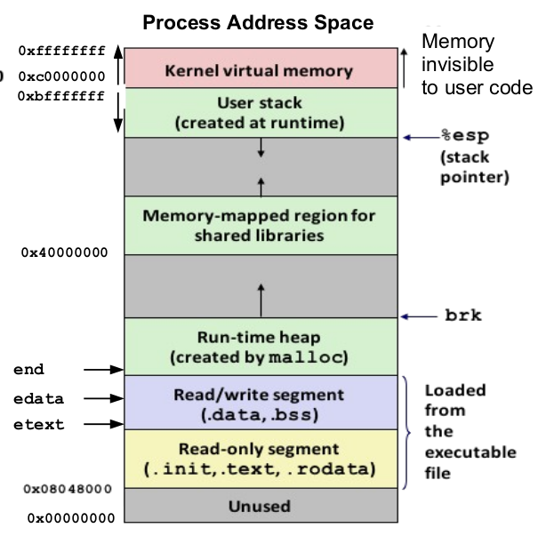
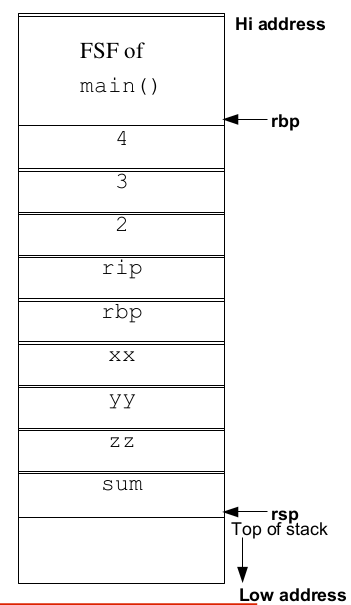

# Stack

The "stack" refers to a region of **memory** that is used for storing local variables, function call information, and other data associated with the execution of a program. It is a **fundamental** data structure used to **manage the flow of control and data** in most programming languages and is particularly **crucial** for managing function calls and local variables efficiently.

The stack operates on the principle of **Last In, First Out (LIFO)**, meaning that the most recently added item is the first one to be removed. When a function is called, a **new frame** is added to the stack, known as the "stack frame" or "activation record." This stack frame contains the function's **parameters, local variables, and other keeping information**.

- *Stack **grows** from **high to
low** addresses in **Intel,
MIPS, Motorola, & SPARC
architectures**.*



- When a function is called, its local variables and parameters are allocated **memory** on the stack.

- If the function makes further calls to other functions (nested calls), each of those functions gets its own stack frame, and the new frame is placed on **top** of the **previous** one.

- When a function completes its **execution** (returns), its stack frame is **removed** from the top of the stack, and control returns to the **calling** function.

- The process continues, with stack frames being **added** and **removed** as functions are **called** and return, respectively.

### Layout of Process Stack

---

A stack typically supports two main operations

- **Push** This operation adds an element to the top of the stack.

- **Pop** This operation removes and returns the top element of the stack.

There is also a common additional operation

**Peek or Top** This operation retrieves the top element of the stack without removing it.
Other common operations that can be useful with stacks are

- **IsEmpty** Checks if the stack is empty.

- **Size** Returns the number of elements currently in the stack.

Stacks can be implemented using various data structures such as **arrays** or **linked** lists. The choice of implementation **depends** on the programming language and the specific requirements of the application.

- **Function** Stack Frames
- Used to store **local** variables
- For **passing** arguments to the functions
- For storing the **return** address
- For storing the base pointer
- Stack grows downward (high to low)
- Frame pointer (**rbp**)
- Stack top (**rsp**)
- Reclaiming stack **memory**

### Usage of Stack

---

- **Function Call Management:** When a function is called in a program, its return address and local variables are stored on the stack. When the function returns, these values are popped off the stack.

- **Expression Evaluation:** Stacks are used to evaluate arithmetic expressions, including **infix, postfix, and prefix** notation.

- **Undo/Redo:** In applications like text editors, stacks can be used to implement undo and redo functionalities.

- **Backtracking:** In algorithms like **depth-first** search, stacks can be used to keep track of visited nodes and **backtrack** when needed.

- **Browser History:** Stacks can be used to manage a history of visited web pages, enabling the back button functionality.

### Function Calling Convention

- Caller Saved (Callee Owned)
- Calee Saved (Caller Owned)
- [Function Call Conventions](https://github.com/meharehsaan/intelx86_64/tree/master/functions#caller-saved-vs-callee-saved-registers)

### Stack Growing and Shrinking

---

Suppose the main() calls another function
foo() , the sequence of steps for creation of
FSF of foo()

- Arguments are pushed on the stack, in reverse
order
- Contents of rip (return address) is also pushed on
the stack
- The contents of rbp containing starting address of
main stack frame is saved on stack for later use,
and rbp is moved to where rsp is pointing to
create new stack frame pointer of function foo()
- Space created for local variables by moving rsp
down or to lower address

### Limitations

---

One limitation of the stack data structure is that it does not support random access to elements. You can only access the **top** element and cannot directly access elements at the middle or bottom of the stack. For **random** access, you would need to use a different **data structure** like an **array or a linked list**.

In summary, a stack is a simple and powerful data structure that facilitates efficient **last-in, first-out (LIFO)** operations. Its usage is prevalent in various programming scenarios, especially in cases where elements need to be managed in a **sequential** manner.

```
int main(){
//some code
return foo(2,3,4);
}

void foo(int a,int b, int c){
int xx = a+2;
int yy = b+2;
int zz = c+2;
int sum = xx + yy + zz;
return sum; 
}
```

#### Stack of the code



Finally when the foo() function executes return
statement, memory on the stack is automatically, and very
efficiently reclaimed

- The saved base pointer is popped and placed in rbp
which moves to the starting address of main FSF.
- The saved return address is popped and placed in rip.
- The stack is shrinked by moving the rsp further up to
where rbp is pointing.

### Buffer Overflow (Stack Overflow)

A buffer overflow is a bug in a program, which occurs
when more data is written to a block of memory than it
can handle

- [Example 01](https://github.com/meharehsaan/intelx86_64/blob/master/funcallconvention/bufferoverflow.c)

<!-- ### Non-Local goto -->

<!-- --- -->

<!-- ## Links -->

<!-- - []() -->