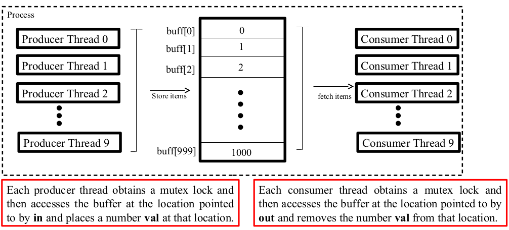
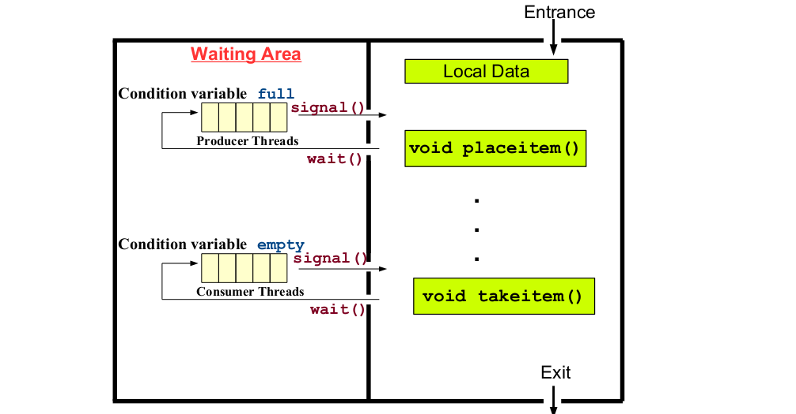

# Synchronization

In computer science synchronization refers to the relationships
among events, e.g., before, during or after

- There are two constraints of synchronization
  - [**Serialization**](https://hazelcast.com/glossary/serialization/): Event **A** must happen **before** event **B**.
  - [**Mutual Exclusion**](https://www.cs.princeton.edu/courses/archive/fall20/cos318/lectures/6.Mutex.pdf): Event **A** and **B** must not happen at the **same** time.

- In multi-threaded programs, the programmer has no control over
when a thread runs, as the **scheduler** makes this decision.
- Concurrent programs are often non-**deterministic**, which means it is
not possible to tell, by looking at the program what will happen
when it will **execute**.
- Concurrent access to **shared** data may result in data **inconsistency**,
so we need to apply some concurrency control mechanism using
which multiple threads can **access** shared data without any **conflict**.

## Example: Deposit and Withdrawal

Consider a bank account having a balance of Rs.100/. A deposit
process deposits Rs. 25/- thus updating the balance of that account to
Rs.125/. A withdrawal process runs and withdraws Rs.10/-, thus
updating the balance of that account to Rs.115/. The instruction that
updates the balance variable can be written in assembly as shown
below

| Deposit Process         | Withdrawal Process |
|:-----------------------:|:------------------:|
| **D1**: MOV R1, balance | **W1**: MOV R2, balance |
| **D2**: ADD R1, wdr_amt | **D2**: SUB R2, deposit_amt |
| **D3**: MOV balance, R1 | **W3**: MOV balance, R2 |

Suppose both the processes run concurrently

- Scenario 01: D1, D2, D3, W1, W2, W3 (balance = Rs.115/-)
- Scenario 02: D1, D2, W1, W2, D3, W3 (balance = Rs.90/-)
- Scenario 03: D1, D2, W1, W2, W3, D3 (balance = Rs.125/-)

#### Problem

- [Race Condition](https://cloudxlab.com/blog/race-condition-and-deadlock/)
- [Critical Section](https://www.scaler.com/topics/critical-section-in-os/)

### Data Sharing Among Threads

---

Normally **modifying** an object **requires** several steps. While
these steps are being carried out the object is typically not in a
well formed state. If another **thread** tries to access the object
during that time, it will likely get a **corrupt** information. The
entire program might have **undefined** behavior after wards.

#### Shared

- **Global** data and **static** **local** data. The case of static local data is
only significant if two (or more) threads execute the function
containing static local variable at the same time.
- **Dynamically** **allocated** data (in heap) that has had its address
put into a global/static variable.
- Data members of a **class** object that has two (or more) of its
member functions called by **different** threads at the same time.

#### Not Shared

- **Local** variables are **not** shared. Even if two threads call the same
function they will have different copies of the **local** variable in that
function. This is because the local variables are kept on **stack** and every
**thread** has its own stack.
- Function **parameters** are not shared. In Languages like C, the parameters
of function are also put on the **stack** & thus every **thread** will have its
own **copy** of those as well.

### Thread Safe vs Reentrant Functions

---

- A thread **safe** function can be called **simultaneously** from
multiple threads, even when the invocations use **shared** data. This
is because each **thread** accesses shared data using some
**concurrency** control mechanism.

- A **reentrant** function can also be called **simultaneously** from
multiple threads, but only if each **invocation** uses its own data.

- Therefore, a **thread-safe** function is always **reentrant**, but a
**reentrant** function is not always **thread safe**.

#### REENTRANT Functions

| Thread **Unsafe** Functions | Thread **Safe** Functions (**REENTRAMT** versions)   |
|:------------------------:|:--------------------------------------------:|
| asctime()                | asctime_r()                                  |
| ctime()                  | ctime_r()                                    |
| gethostbyname()          | gethostbyname_r()                            |
| gethostbyaddr()          | gethostbyaddr_r()                            |
| rand()                   | rand_r()                                     |
| localtime()              | localtime_r()                                |
| crypt()                  | crypt_r()                                    |

```bash
gcc -c thread1.c -D_REENTRANT
gcc thread1.o -o thread1 -lpthread
gcc thread1.c -o thread1 -lpthread -D_REENTRANT
```

### Synchronization using Mutex

---

A mutex is a **Mutual** **Exclusion** device, and is useful for
protecting **shared** data structures from **concurrent** modifications,
and implementing **critical** sections.

- A mutex has two possible states
  - **Unlocked** (not owned by any thread)
  - **Locked** (owned by one thread).
It can **never** be owned by two **different** threads simultaneously.

- A thread attempting to **lock** a mutex that is already locked by
another thread is **suspended** until the owner thread **unlocks** the
mutex
- Linux **guarantees** that race condition do **not** **occur** among threads
attempting to lock a **mutex**.

### Use a Mutex

i. **Create** and **initialize** a mutex variable
ii. Several threads attempt to **lock** the mutex
iii. Only one thread **succeed** and that thread owns the mutex
iv. The owner thread carry out operations on **shared** data
v. The owner threads **unlock** the mutex
vi. Another thread **acquires** the mutex and **repeats** the process
vii. Finally the mutex is **destroyed**.

### Mutex Initialization

---

- **Static Initialization** In case where default mutex attributes are
appropriate, the following macro can be used to initialize a mutex that is
statically allocated.

```C
pthread_mutex_t mut = PTHREAD_MUTEX_INITIALIZER;
```

- **Run time initialization** In all other cases, we must dynamically initialize
the mutex using **pthread_mutex_init**().

```C
int pthread_mutex_init (pthread_mutex_t* mptr, const pthread_mutexattr_t * attr);
```

This function initializes the mutex object pointed to by **mptr** according to
the mutex attributes specified in **attr**. If attr is **NULL**, **default**
attributes are used instead.

```C
int pthread_mutex_lock(pthread_mutex_t *mptr);
int pthread_mutex_unlock(pthread_mutex_t *mptr);
int pthread_mutex_trylock(pthread_mutex_t *mptr);
int pthread_mutex_destroy(pthread_mutex_t *mptr);
```

- The **lock**() call will lock the pthread_mutex_t object referenced by
mptr. If mutex is already locked, the calling thread blocks until the mutex is
unlocked
- The **trylock**() is similar to lock except that if the mutex object is currently
locked, the call returns immediately with the error code **EBUSY**
- The **unlock**()call release the mutex object. The manner in which a mutex is
released is dependent on the mutex's attribute type. If there are threads
blocked on the mutex object referenced by mptr when unlock() is called,
the scheduling policy shall determine which thread shall acquire the mutex
- The **destroy**() call destroys the mutex object.

### Mutex Dead Locks

---

- Be sure to observe following points to avoid dead locks while
using mutexes

i. No thread should attempt to lock or unlock a mutex that has not
been initialized
ii. Only the owner thread of the mutex (i.e the one which has
locked the mutex) should unlock it
iii.Do not lock a mutex that is already locked
iv.Do not unlock a mutex that is not locked
v. Do not destroy a locked mutex.

### Mutex Attributes

---

```C
PTHREAD_MUTEX_INITIALIZER (fast mutex)
```

- Locking an already locked mutex results in suspending the calling thread.
- Unlocking an already unlocked mutex results in undefined behavior.
- Unlocking a mutex that is not locked by calling thread results in undefined behavior.

```C
PTHREAD_ERRORCHECK_MUTEX_INITIALIZER_NP(error checking mutex)
```

- Locking an already locked mutex returns immediately with an error EDEADLK.
- Unlocking an already unlocked mutex returns an error.
- Unlocking a mutex that is not locked by calling thread returns an error.

```C
PTHREAD_RECURSIVE_MUTEX_INITIALIZER_NP (recursive mutex)
```

- Locking an already locked mutex returns immediately with a success return code.
The number of times the thread owning the mutex has locked it is recorded in the
mutex. The owning thread must call **pthread_mutex_unlock**() the same number of
times before the mutex returns to the unlocked state.
- Unlocking an unlocked mutex returns an error.

```C
int pthread_mutexattr_init(pthread_mutexattr_t *attr);
int pthread_mutexattr_settype(pthread_mutexattr_t *attr, int kind);
```

- A mutex has a set of attributes which can be set before creating it and passed
to the pthread_mutex_init() function as its second argument. (which
we have kept NULL in previous examples)
- The **pthread_mutexattr_init**() function initializes the mutex attribute object attr and fills it with default values for the attributes
-The **pthread_mutexattr_settype**() sets the mutex kind attribute in
attr to the value specified by second argument kind
- LinuxThreads supports only one mutex attribute, the mutex kind
  - **PTHREAD_MUTEX_FAST_NP**
for fast mutex
  - **PTHREAD_MUTEX_RECURSIVE_NP** for recursive mutex
  - **PTHREAD_MUTEX_ERRORCHECK_NP** for error checking mutex

Note: NP means, these are non-portable extension to **POSIX** standard

### Producer-Consumer Problem

---

Producer produces information that is consumed by a consumer
process.To allow producer and consumer run concurrently we must
have a buffer that can be filled by the producer and emptied by the
consumer.The buffer can be bounded or unbounded

- **Unbounded Buffer** Places no practical limit on the size of the buffer.
The consumer may have to wait for new items if the buffer is empty,
but the producer can always produce new items.
- **Bounded Buffer** Assumes a fixed size buffer. The consumer must
wait if the buffer is empty and the producer must wait if the buffer is
full.

While an item is being added to or removed from the buffer, the buffer is
in an inconsistent state. Therefore, threads must have exclusive access to
the buffer. If a consumer thread arrives while the buffer is empty, it blocks
until a producer adds a new item.

#### Implicit Synchronization

```bash
grep prog1.c | wc –l
```

**grep** is a producer process and **wc** is a consumer process. **grep** writes
into the pipe and wc reads from the pipe. The required **synchronization** is
handled implicitly by the kernel. If producer gets ahead of the consumer
(i.e. the pipe fills up), the kernel puts the producer to sleep when it calls
**write**(), until more room is available in the pipe. If consumer gets
ahead of the producer (i.e. the pipe is empty), the kernel puts the
consumer to sleep when it calls **read**(), until some data is there in the
pipe.

#### Explicit Synchronization

When we as programmers are using some shared memory/data structure,
we use some form of IPC between the procedure and the consumer for
data transfer. We also need to ensure that some type of explicit
synchronization must be performed between the producer and consumer.

---



### Condition Variables

---

Solution to such problems like the producer-consumer, reader-writer,
barber-shop and so on are condition variables.

- A condition variable is a synchronization construct that allows threads
to suspend execution and relinquish the processors until some
condition is satisfied
- The two basic operations on condition variables are
  - **signal**() Wake up a sleeping thread on this condition variable
  - **wait**() Release lock, goto sleep, reacquire lock after you are awoken up
- So we can say that a condition variable enable a thread to sleep inside
a CS. Any lock held by the thread is automatically released when the
thread is put to sleep
- A mutex is for locking and a condition variable is for waiting

---



With every condition variable there is an associated mutex variable. Whenever a thread
wants to invoke **wait**() or **signal**() operation, it must hold the mutex associated
with that condition variable

### Example: wait() and signal()

Consider the buffer protected by mutex mut, and a condition variable
empty

- A call to **pthread_cond_wait**() should be done as part of a conditional statement, e.g., the consumer thread will wait on condition variable empty only when the buffer gets empty.
- The producer thread will give a signal on condition variable empty, when it
places the first item in the buffer
- When the condition variable cond is signaled by a consumer thread,
**pthread_cond_wait**() will implicitly lock the mutex again before
returning. That is the reason the **pthread_mutex_unlock**() statement
is required after modifying the buffer by the producer thread.

## Links

- [SERIALIZER](https://courses.cs.vt.edu/~cs5204/fall99/Summaries/Concurrency/serializers2.html)
- [Synchronization](https://courses.cs.washington.edu/courses/cse451/13wi/lectures/8%20-%20Synchronization.pdf)
- [Process Synchronization](https://www.cs.uic.edu/~jbell/CourseNotes/OperatingSystems/5_Synchronization.html)
- [Locks and Synchronization](https://web.mit.edu/6.005/www/fa15/classes/23-locks/)
- [Process Synchronization in OS](https://www.scaler.com/topics/operating-system/process-synchronization-in-os/)
- [Thread Synchronization Primitives](https://tropars.github.io/downloads/lectures/M1_OS/lecture_11--Thread_synchro_primitives.pdf)
- [Concurrency and Mutual Exclusion](https://inst.eecs.berkeley.edu/~cs162/su21/static/lectures/su21/6.pdf)