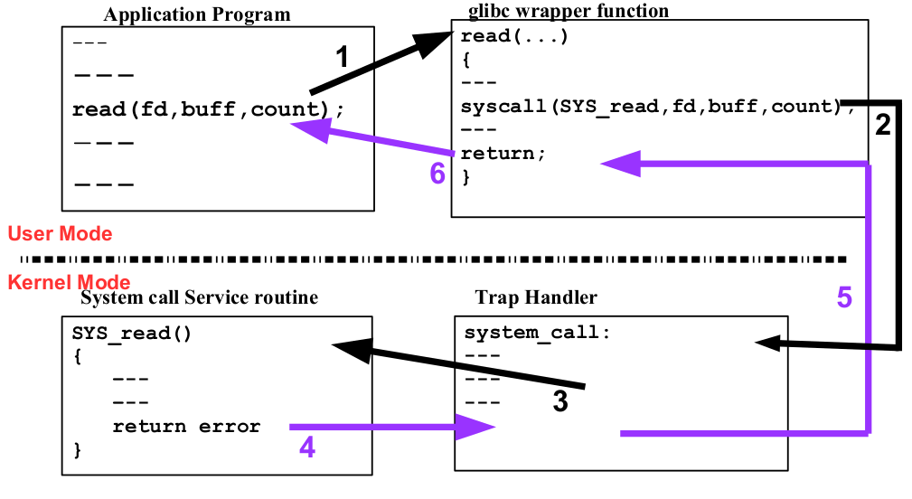

# System calls

The system call is the fundamental **interface** between an **application** and the Linux **kernel**. A system call is a just C **function** in the kernel space.

System calls are generally not invoked **directly**, but rather via **wrapper** functions in **glibc**.

### Introduction

---

A system call is a **programmatic** way a program requests a service from the [kernel](https://www.redhat.com/en/topics/linux/what-is-the-linux-kernel). An operating system can roughly be divided into two modes:

* **Kernel mode:** A privileged and powerful mode used by the operating system kernel
* **User mode:** Where most user applications run
  
Users mostly work with **command**-line utilities and **graphical** user interfaces (GUI) to do day-to-day tasks. System calls work silently in the background, **interfacing** with the kernel to get work done.

System calls are very **similar** to [function calls](https://www.javatpoint.com/what-is-the-function-call-in-c), which means they accept and work on arguments and return values. The only difference is that system calls enter a kernel, while function calls do not. Switching from user space to kernel space is done using a special [trap](https://en.wikipedia.org/wiki/Interrupt) mechanism.

Most of this is hidden away from the user by using system **libraries** (aka [glibc](https://www.gnu.org/software/libc/) on Linux systems). Even though system calls are generic in nature, the mechanics of issuing a system call are very much machine-dependent.

### System Call Invocation

---

System call invocation in Linux typically involves the following steps

* **Preparing Parameters** The user-level application prepares the necessary parameters for the system call. These parameters depend on the specific system call being invoked. For example, opening a file requires the filename and flags as parameters.

* **Selecting the System Call Number** Each system call in Linux is identified by a unique number. The application needs to indicate which system call it wants to invoke by placing the appropriate system call number into a register or a specific CPU instruction. On x86 systems, this is often done by placing the system call number in the EAX register.

* **Transferring Control to the Kernel** To transition from user mode to kernel mode and invoke the system call, the application triggers a software interrupt or an exception. In x86 architecture, this is usually done by using the "int 0x80" instruction or the "syscall" instruction for newer 64-bit systems.

* **Kernel Handling** When the kernel receives the software interrupt or exception, it interprets the system call number provided by the application and performs the requested operation using the supplied parameters.

* **Returning to User Mode** Once the kernel has completed the requested operation, it returns the result to the user-level application. If an error occurred during the system call, an error code is usually returned.

* **Error Handling** The user-level application checks the return value to determine whether the system call was successful or not. If an error occurred, the application can check the specific error code to determine the nature of the error.

### How System Calls Work on Linux/i86

---

The 386 recognizes two event classes: **exceptions** and **interrupts**. Both cause a forced context switch to new a procedure or task. Interrupts can occur at unexpected times during the execution of a program and are used to respond to signals from hardware. Exceptions are caused by the execution of instructions. Two sources of interrupts are recognized by the 386.

* **Maskable** interrupts
* **Nonmaskable** interrupts

Two sources of exceptions are recognized by the 386: Processor detected exceptions and programmed exceptions. Under Linux the execution of a system call is invoked by a **maskable** interrupt or exception class transfer, caused by the instruction **int 0x80** or **syscall**. We use them to transfer control to the kernel.

### How Linux Uses Interrupts and Exceptions

---

* Each call is vectored through a **stub in libc**. Each call within the libc library is generally a **syscallX**() macro, where X is the number of **parameters** used by the actual routine. Some system calls are more complex then others because of variable length argument lists, but even these complex system calls must use the same entry point: they just have more parameter setup **overhead**. Examples of a complex system call include **open() and ioctl()**.
* Each syscall macro expands to an assembly routine which sets up the calling stack frame and calls **_system_call()** through an interrupt, via the instruction **int 0x80**.

* The macro definition for the syscallX() macros can be found in **/usr/include/linux/unistd.h**, and the user-space system call library code can be found in **/usr/src/libc/syscall/**
At this point no system code for the call has been executed. Not until the int $0x80 is executed does the call transfer to the kernel entry point _system_call(). This entry point is the same for all system calls. It is responsible for saving all **registers**, checking to make sure a valid system call was invoked and then ultimately transfering control to the actual system call code via the offsets in **the_sys_call_table**. It is also responsible for **calling_ret_from_sys_call()** when the system call has been completed, but before returning to user space.

* After the system call has executed, **_ret_from_sys_call()** is called. It checks to see if the **scheduler** should be run, and if so, calls it.

* Upon return from the system call, the syscallX() macro code checks for a **negative** return value, and if there is one, puts a positive copy of the return value in the global variable **_errno**, so that it can be accessed by code like **perror()**.

### Working

---

Often the [glibc](https://www.gnu.org/software/libc/) wrapper function is quite thin, doing little work other than **copying** **arguments** to the right **registers** before invoking the system call, and then setting errno appropriately after the system call has returned.

Syscall instruction invokes a handler of a given system call. But how does it know which handler to call? Actually it gets this information from the **general purpose registers**. As you can see in the system call table, each system call has a unique number. In our example the first system call is write, which writes data to the given file. Let's look in the system call table and try to find the write system call. As we can see, the write system call has number 1. We pass the number of this system call through the rax register in our example. The next general purpose registers: **rdi, rsi, and rdx** take the three parameters of the write syscall. In our case, they are:

* [File descriptor](https://en.wikipedia.org/wiki/File_descriptor) (1 is [stdout](https://en.wikipedia.org/wiki/Standard_streams#Standard_output_.28stdout.29) in our case).
* Pointer to string.
* Size of data.

### Library  calls

---

There are no **fopen, fgets, printf, and fclose** system calls in the Linux kernel, but **open, read, write, and close** instead. I think you know that fopen, fgets, printf, and fclose are defined in the C standard library. Actually, these functions are just **wrappers** for the system calls.

* We do not call system calls directly in our code, but instead use these wrapper functions from the standard library.

The main reason of this is simple: a system call must be performed quickly, very quickly. As a system call must be quick, it must be small. The standard library takes responsibility to perform system calls with the correct parameters and makes different checks before it will call the given system call.

System calls are **ubiquitous**. Each program needs to open/write/read files and network connections, allocate **memory**, and many other things that can be provided only by the kernel. The proc file system contains special files in a format: /proc/${pid}/syscall that exposes the system call number and argument registers for the system call currently being executed by the process.

The ltrace util displays a set of **userspace** calls of a program. The fopen function opens the given text file, the fgets function reads file content to the buf buffer, the puts function prints the buffer to stdout, and the fclose function closes the file given by the file descriptor.

## Links

* [System call](https://en.wikipedia.org/wiki/System_call)
* [System call table](https://github.com/torvalds/linux/blob/16f73eb02d7e1765ccab3d2018e0bd98eb93d973/arch/x86/entry/syscalls/syscall_64.tbl)
* [System Calls in OS](https://www.scaler.com/topics/operating-system/system-calls-in-operating-system/)
* [Wrapper Functions](https://en.wikipedia.org/wiki/Wrapper_function)
* [System Call Interface](https://w3.cs.jmu.edu/kirkpams/OpenCSF/Books/csf/html/Syscall.html)
* [What Does the 386 Provide?](https://tldp.org/LDP/khg/HyperNews/get/syscall/syscall86.html#:~:text=Under%20Linux%20the%20execution%20of,transfer%20control%20to%20the%20kernel.)
* [System calls in the Linux kernel](https://0xax.gitbooks.io/linux-insides/content/SysCall/linux-syscall-1.html)
